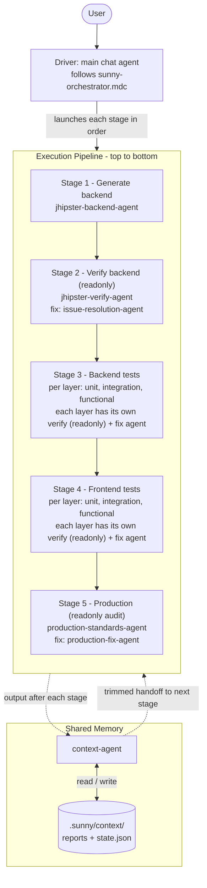
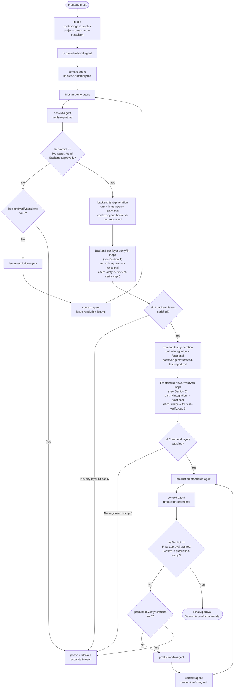
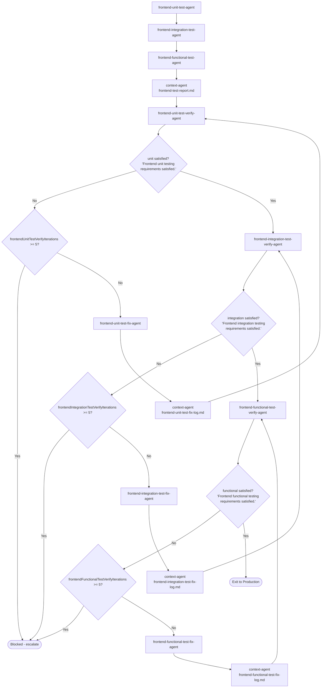
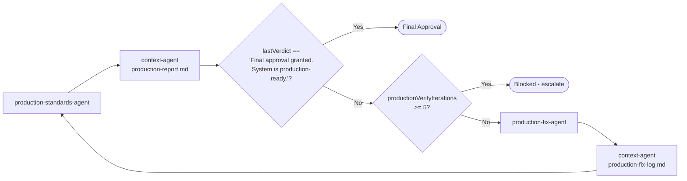
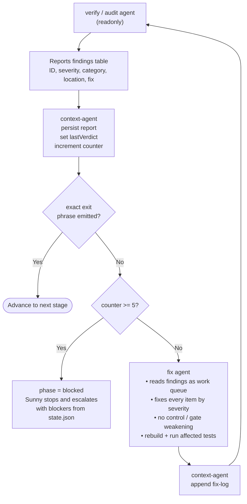
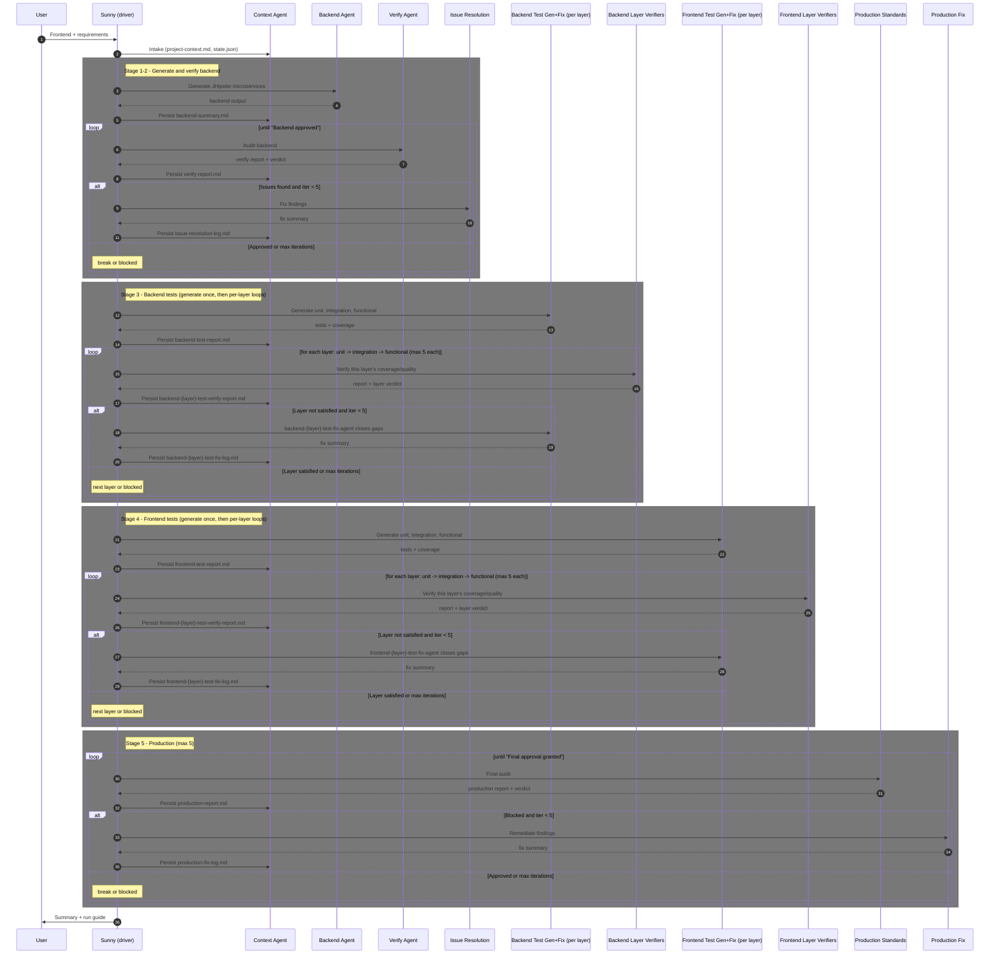
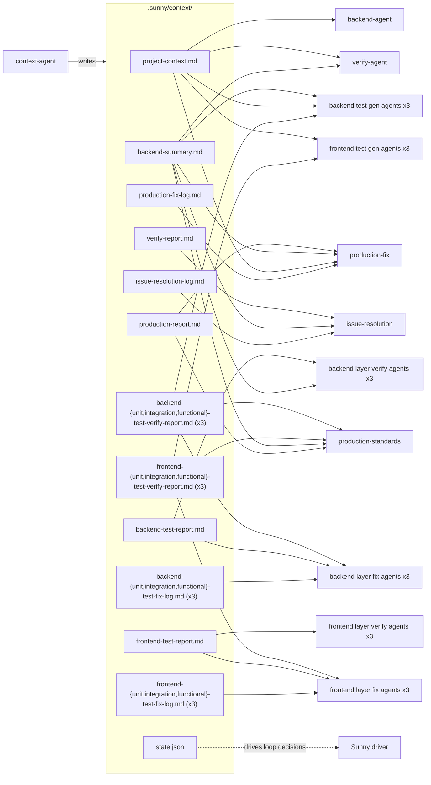
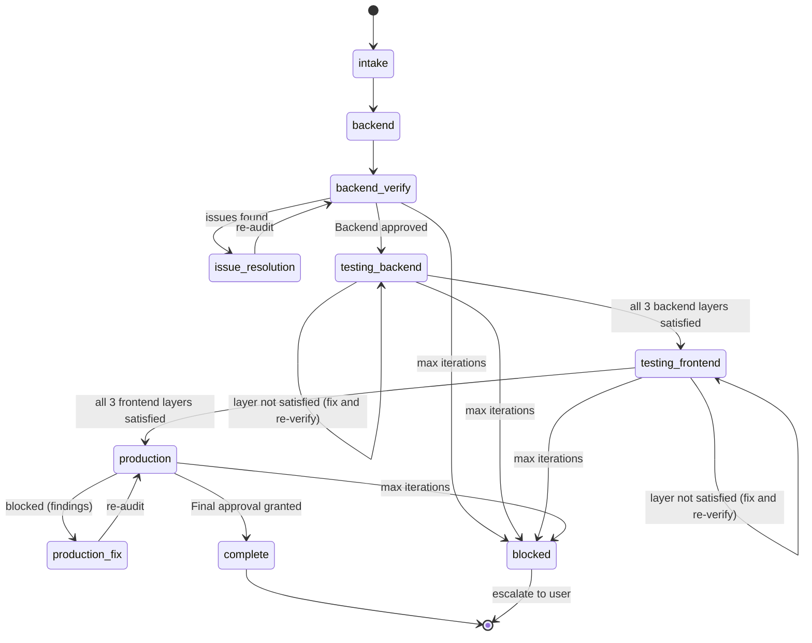

# Sunny Orchestrator — Architecture & Workflow

Visual reference for the Sunny multi-agent system: component architecture, control flow, the verification/testing/production loops, shared-memory data flow, and state transitions.

> For prose explanation and run instructions, see [`README.md`](README.md).

---

## 0. System at a glance

**25 orchestrated agents** (plus a standalone documentation agent), driven through **8 bounded verify/fix loops**.

| Group | Count | Agents |
|-------|-------|--------|
| Orchestration & memory | 2 | `sunny`, `context-agent` |
| Backend build & verify | 3 | `jhipster-backend-agent`, `jhipster-verify-agent` (readonly), `issue-resolution-agent` |
| Backend tests (3 layers × gen/verify/fix) | 9 | `backend-{unit,integration,functional}-test-agent` + `-verify-agent` (readonly) + `-fix-agent` |
| Frontend tests (3 layers × gen/verify/fix) | 9 | `frontend-{unit,integration,functional}-test-agent` + `-verify-agent` (readonly) + `-fix-agent` |
| Production | 2 | `production-standards-agent` (readonly), `production-fix-agent` |
| Standalone (not orchestrated) | 1 | `documentation` |

- **8 verify/fix loops:** backend code + 3 backend test layers + 3 frontend test layers + production.
- **8 readonly auditors:** `jhipster-verify-agent`, the 6 per-layer test-verify agents, and `production-standards-agent`.
- **Every loop:** independent exit phrase + iteration counter, capped at **5** before escalating.
- **One writer of shared memory:** `context-agent` owns `.sunny/context/`.

---

## 1. System architecture (pipeline order)

The agents run as an **ordered pipeline**: generate the backend, verify and fix it, then generate and verify tests (backend, then frontend), then the final production audit. The Driver (main chat agent) launches each stage via the Task tool, and the Context Agent persists output between every stage. Read top to bottom — generation always precedes verification.

### 1.1 Agents and their responsibilities

Each agent with its key points, grouped by stage. Readonly agents only audit and report; all others write code/tests/config.

```mermaid
flowchart TB
    subgraph orch [Orchestration and Memory]
        direction LR
        DRV["Sunny / Driver<br/>• Orchestrates all 8 verify/fix loops<br/>• Matches exact exit phrases<br/>• Enforces quality gates<br/>• Escalates when blocked"]
        CTX["context-agent<br/>• Sole writer of .sunny/context<br/>• Structured summaries + state.json<br/>• Trims handoffs to next agent<br/>• Tracks phase + iteration counters"]
    end

    subgraph s12 [Stage 1-2 - Backend build and verify]
        direction LR
        GEN["jhipster-backend-agent<br/>• Microservices: gateway + services + registry<br/>• PostgreSQL + Liquibase<br/>• JWT/OAuth2 + RBAC, Docker<br/>• No mock/fake data"]
        VER["jhipster-verify-agent - readonly<br/>• REST/OpenAPI/RFC7807 audit<br/>• Auth + vulnerability checks<br/>• Microservices + DB integrity<br/>• Exit: No issues found. Backend approved."]
        ISS["issue-resolution-agent<br/>• Fixes every verify finding<br/>• No control weakening<br/>• Rebuild + run tests<br/>• Returns for re-audit"]
        GEN --> VER
        VER -->|issues| ISS --> VER
    end

    subgraph s3 [Stage 3 - Backend testing - per-layer verify and fix]
        direction TB
        subgraph s3u [Unit layer]
            direction LR
            BU["backend-unit-test-agent<br/>• JUnit5 + Mockito<br/>• Services, mappers, validators<br/>• Fully mocked/isolated"]
            BUV["backend-unit-test-verify-agent - readonly<br/>• Unit coverage + isolation<br/>• Exit: Backend unit testing requirements satisfied."]
            BUF["backend-unit-test-fix-agent<br/>• Closes unit-layer gaps"]
            BU --> BUV
            BUV -->|gaps| BUF --> BUV
        end
        subgraph s3i [Integration layer]
            direction LR
            BI["backend-integration-test-agent<br/>• Testcontainers PostgreSQL<br/>• Repos, queries, migrations<br/>• Real DB, no H2"]
            BIV["backend-integration-test-verify-agent - readonly<br/>• Real-DB + integration coverage<br/>• Exit: Backend integration testing requirements satisfied."]
            BIF["backend-integration-test-fix-agent<br/>• Closes integration-layer gaps"]
            BI --> BIV
            BIV -->|gaps| BIF --> BIV
        end
        subgraph s3f [Functional layer]
            direction LR
            BF["backend-functional-test-agent<br/>• REST Assured / MockMvc<br/>• Endpoints, auth, pagination<br/>• ProblemDetails + gateway E2E"]
            BFV["backend-functional-test-verify-agent - readonly<br/>• Endpoint + contract coverage<br/>• Exit: Backend functional testing requirements satisfied."]
            BFF["backend-functional-test-fix-agent<br/>• Closes functional-layer gaps"]
            BF --> BFV
            BFV -->|gaps| BFF --> BFV
        end
        s3u --> s3i --> s3f
    end

    subgraph s4 [Stage 4 - Frontend testing - per-layer verify and fix]
        direction TB
        subgraph s4u [Unit layer]
            direction LR
            FU["frontend-unit-test-agent<br/>• Vitest/Jest<br/>• Utils, hooks, stores<br/>• Isolated"]
            FUV["frontend-unit-test-verify-agent - readonly<br/>• Unit coverage + isolation<br/>• Exit: Frontend unit testing requirements satisfied."]
            FUF["frontend-unit-test-fix-agent<br/>• Closes unit-layer gaps"]
            FU --> FUV
            FUV -->|gaps| FUF --> FUV
        end
        subgraph s4i [Integration / component layer]
            direction LR
            FI["frontend-integration-test-agent<br/>• Testing Library + MSW<br/>• Components, pages, routing<br/>• Events + loading/error states"]
            FIV["frontend-integration-test-verify-agent - readonly<br/>• Component coverage + states<br/>• Exit: Frontend integration testing requirements satisfied."]
            FIF["frontend-integration-test-fix-agent<br/>• Closes component-layer gaps"]
            FI --> FIV
            FIV -->|gaps| FIF --> FIV
        end
        subgraph s4f [Functional / E2E layer]
            direction LR
            FF["frontend-functional-test-agent<br/>• Playwright E2E<br/>• Critical user journeys<br/>• Login, CRUD, navigation"]
            FFV["frontend-functional-test-verify-agent - readonly<br/>• Journey coverage in real browser<br/>• Exit: Frontend functional testing requirements satisfied."]
            FFF["frontend-functional-test-fix-agent<br/>• Closes E2E journey gaps"]
            FF --> FFV
            FFV -->|gaps| FFF --> FFV
        end
        s4u --> s4i --> s4f
    end

    subgraph s5 [Stage 5 - Production]
        direction LR
        PS["production-standards-agent - readonly<br/>• Security + readiness audit<br/>• Industry standards + performance<br/>• Requires prior approved verdicts<br/>• Exit: Final approval granted. System is production-ready."]
        PF["production-fix-agent<br/>• Remediates PR findings<br/>• No control weakening<br/>• Rebuild + run tests<br/>• Returns for re-audit"]
        PS -->|blocked| PF --> PS
    end

    orch --> s12 --> s3 --> s4 --> s5
```

---

## 2. End-to-end workflow (control flow)

The strict call order with all loops and their exact exit phrases.

---

## 3. Backend code verification loop (detail)

## 4. Backend testing loops (detail)

The three generation agents run **once** in order. Then each layer has its **own verify/fix loop** with its own exit phrase and counter, run in order: unit → integration → functional. Each layer's fix agent only touches that layer.

## 5. Frontend testing loops (detail)

Same per-layer structure for the frontend: generate once, then unit → integration/component → functional/E2E, each with its own verify/fix loop, exit phrase, and counter.

## 6. Production loop (detail)

---

## 7. What happens when something fails (fix and re-verify)

Every stage uses the **same failure-handling mechanism**. When a verify/audit agent does not emit its exact exit phrase, the work goes to the matching fix agent, then back for a fresh re-audit — bounded by the 5-iteration cap.

### The rules that make this safe

1. **The fixer cannot mark its own homework.** Only the readonly verify/audit agent can emit the exit phrase. A fix is "accepted" only when an independent re-audit passes.
2. **Re-verification is from scratch.** The verify agent re-audits the real code with no memory of the fixes, so an incomplete fix is caught again.
3. **One round = one iteration.** Each verify run increments that loop's own counter (`backendVerifyIterations`; the six per-layer test counters `backend/frontend{Unit,Integration,Functional}TestVerifyIterations`; `productionVerifyIterations`).
4. **The cap is checked before fixing again.** If the counter hits `maxIterations` (default 5) without the exit phrase, Sunny sets `phase: "blocked"`, stops, and hands the remaining blockers to the user — never an infinite loop.
5. **New findings are allowed.** A fix may surface fresh issues; they appear in the next report and are addressed in the next round (while under the cap).
6. **Fixers never weaken controls.** They do not disable auth, loosen CORS to `*`, remove validation, lower coverage thresholds, or introduce mock data to force a pass — they fix the root cause.

### Same mechanism across all eight loops

| Loop | Verify / audit agent | Fix agent | Counter | Exit phrase |
|------|----------------------|-----------|---------|-------------|
| Backend code | `jhipster-verify-agent` | `issue-resolution-agent` | `backendVerifyIterations` | `No issues found. Backend approved.` |
| Backend unit tests | `backend-unit-test-verify-agent` | `backend-unit-test-fix-agent` | `backendUnitTestVerifyIterations` | `Backend unit testing requirements satisfied.` |
| Backend integration tests | `backend-integration-test-verify-agent` | `backend-integration-test-fix-agent` | `backendIntegrationTestVerifyIterations` | `Backend integration testing requirements satisfied.` |
| Backend functional tests | `backend-functional-test-verify-agent` | `backend-functional-test-fix-agent` | `backendFunctionalTestVerifyIterations` | `Backend functional testing requirements satisfied.` |
| Frontend unit tests | `frontend-unit-test-verify-agent` | `frontend-unit-test-fix-agent` | `frontendUnitTestVerifyIterations` | `Frontend unit testing requirements satisfied.` |
| Frontend integration tests | `frontend-integration-test-verify-agent` | `frontend-integration-test-fix-agent` | `frontendIntegrationTestVerifyIterations` | `Frontend integration testing requirements satisfied.` |
| Frontend functional tests | `frontend-functional-test-verify-agent` | `frontend-functional-test-fix-agent` | `frontendFunctionalTestVerifyIterations` | `Frontend functional testing requirements satisfied.` |
| Production | `production-standards-agent` | `production-fix-agent` | `productionVerifyIterations` | `Final approval granted. System is production-ready.` |

> Each side's three generation agents (unit/integration/functional) run once at the start; then each layer has its own verify/fix loop. On failure the layer's fix agent adds or repairs that layer's tests, then the layer re-verifies — the generators are not re-run.

---

## 8. Phase sequence (who talks to whom, when)

---

## 9. Shared-memory data flow

Only the Context Agent writes the store; every other agent reads trimmed handoffs.

---

## 10. Workflow state machine

`state.json.phase` transitions that the orchestrator follows.

> Within `testing_backend` and `testing_frontend`, the layers are verified/fixed in order — unit → integration → functional — each with its own exit phrase and iteration counter. The side advances only when all three layers are satisfied.

---

## Legend

| Concept | Meaning |
|---------|---------|
| **Driver** | Main chat agent that follows the playbook and launches sub-agents via the Task tool |
| **Solid arrow** | Control flow / Task launch |
| **Dotted arrow** | Data flow (persist / handoff) |
| **readonly agent** | Audits and reports only; makes no code changes (jhipster-verify, the six per-layer test-verify agents, production-standards) |
| **Exit phrase** | Exact string in `state.json.lastVerdict` that breaks a loop |
| **Backend code exit** | `No issues found. Backend approved.` |
| **Backend test exits** | `Backend unit testing requirements satisfied.` / `Backend integration testing requirements satisfied.` / `Backend functional testing requirements satisfied.` |
| **Frontend test exits** | `Frontend unit testing requirements satisfied.` / `Frontend integration testing requirements satisfied.` / `Frontend functional testing requirements satisfied.` |
| **Production exit** | `Final approval granted. System is production-ready.` |
| **Max iterations** | Default 5 per loop; each loop has its own counter (`backendVerifyIterations`; the six `backend/frontend{Unit,Integration,Functional}TestVerifyIterations`; `productionVerifyIterations`); exceeding it sets `phase = blocked` **before** launching the fix agent again |
