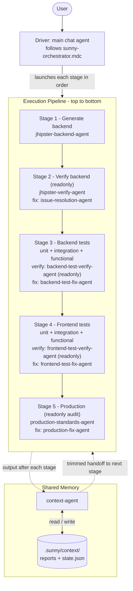
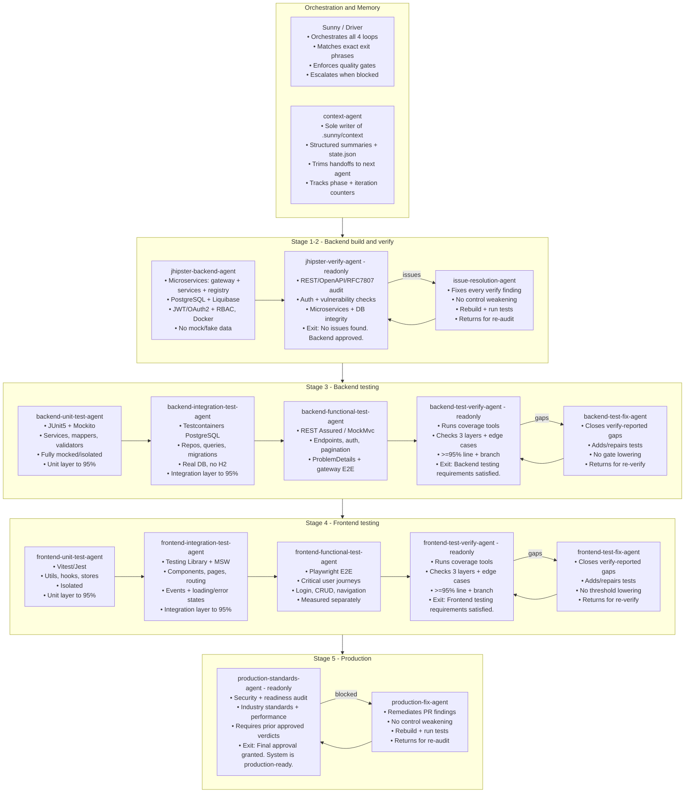
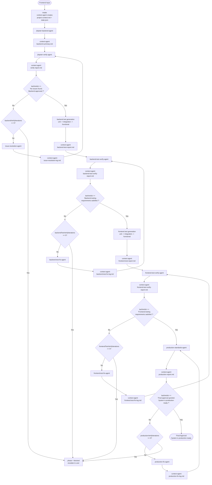
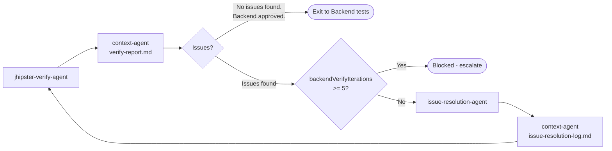
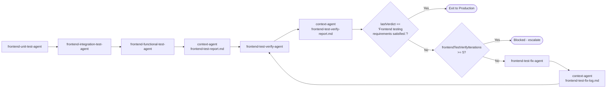
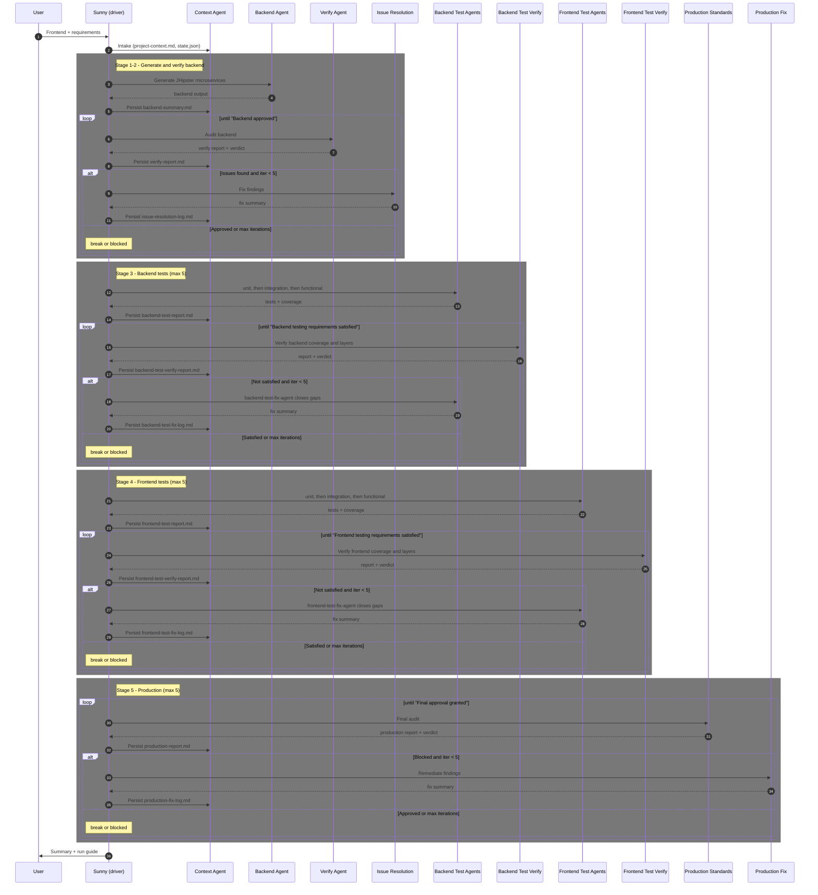
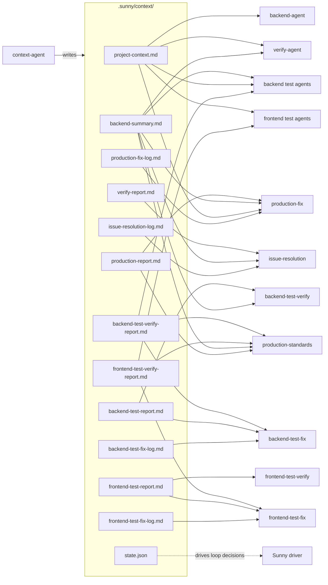
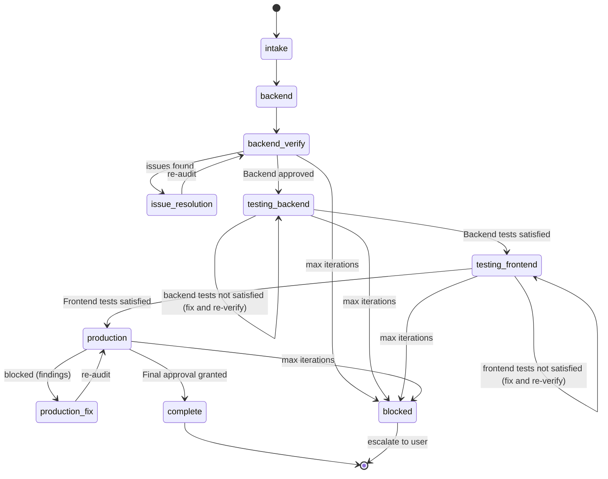

# Sunny Orchestrator — Architecture & Workflow

Visual reference for the Sunny multi-agent system: component architecture, control flow, the verification/testing/production loops, shared-memory data flow, and state transitions.

> For prose explanation and run instructions, see [`README.md`](README.md).

---

## 1. System architecture (pipeline order)

The agents run as an **ordered pipeline**: generate the backend, verify and fix it, then generate and verify tests (backend, then frontend), then the final production audit. The Driver (main chat agent) launches each stage via the Task tool, and the Context Agent persists output between every stage. Read top to bottom — generation always precedes verification.

### 1.1 Agents and their responsibilities

Each agent with its key points, grouped by stage. Readonly agents only audit and report; all others write code/tests/config.

---

## 2. End-to-end workflow (control flow)

The strict call order with all loops and their exact exit phrases.

---

## 3. Backend code verification loop (detail)

## 4. Backend testing loop (detail)

Three generation agents run once in order, then verify <-> fix until satisfied.

## 5. Frontend testing loop (detail)

## 6. Production loop (detail)

---

## 7. Phase sequence (who talks to whom, when)

---

## 8. Shared-memory data flow

Only the Context Agent writes the store; every other agent reads trimmed handoffs.

---

## 9. Workflow state machine

`state.json.phase` transitions that the orchestrator follows.

---

## Legend

| Concept | Meaning |
|---------|---------|
| **Driver** | Main chat agent that follows the playbook and launches sub-agents via the Task tool |
| **Solid arrow** | Control flow / Task launch |
| **Dotted arrow** | Data flow (persist / handoff) |
| **readonly agent** | Audits and reports only; makes no code changes (jhipster-verify, backend/frontend-test-verify, production) |
| **Exit phrase** | Exact string in `state.json.lastVerdict` that breaks a loop |
| **Backend code exit** | `No issues found. Backend approved.` |
| **Backend tests exit** | `Backend testing requirements satisfied.` |
| **Frontend tests exit** | `Frontend testing requirements satisfied.` |
| **Production exit** | `Final approval granted. System is production-ready.` |
| **Max iterations** | Default 5 per loop (`backendVerifyIterations` / `backendTestVerifyIterations` / `frontendTestVerifyIterations` / `productionVerifyIterations`); exceeding it sets `phase = blocked` **before** launching the fix agent again |
