# Sunny Orchestrator — Architecture & Workflow

Visual reference for the Sunny multi-agent system: component architecture, control flow, the verification/testing/production loops, shared-memory data flow, and state transitions.

> For prose explanation and run instructions, see [`README.md`](README.md).

---

## 0. System at a glance

**52 orchestrated agents** (plus a standalone documentation agent), driven through **17 bounded verify/fix loops**.

| Group | Count | Agents |
|-------|-------|--------|
| Orchestration & memory | 2 | `sunny`, `context-agent` |
| Architecture & boilerplate | 3 | `architecture-agent`, `architecture-verify-agent` (readonly), `architecture-fix-agent` |
| Backend build & verify | 3 | `jhipster-backend-agent`, `jhipster-verify-agent` (readonly), `issue-resolution-agent` |
| Database | 3 | `database-agent`, `database-verify-agent` (readonly), `database-fix-agent` |
| Nginx & SSL edge | 3 | `nginx-agent`, `nginx-verify-agent` (readonly), `nginx-fix-agent` |
| Backend tests (3 layers × gen/verify/fix) | 9 | `backend-{unit,integration,functional}-test-agent` + `-verify-agent` (readonly) + `-fix-agent` |
| Frontend tests (3 layers × gen/verify/fix) | 9 | `frontend-{unit,integration,functional}-test-agent` + `-verify-agent` (readonly) + `-fix-agent` |
| System integration tests (collective) | 3 | `system-integration-test-agent`, `system-integration-test-verify-agent` (readonly), `system-integration-test-fix-agent` |
| Swagger / OpenAPI docs | 3 | `swagger-agent`, `swagger-verify-agent` (readonly), `swagger-fix-agent` |
| Javadoc | 3 | `javadoc-agent`, `javadoc-verify-agent` (readonly), `javadoc-fix-agent` |
| API collection (Postman) | 3 | `api-collection-agent`, `api-collection-verify-agent` (readonly), `api-collection-fix-agent` |
| API tests (status) | 3 | `api-test-agent`, `api-test-verify-agent` (readonly), `api-test-fix-agent` |
| API performance (1/10/20/30) | 3 | `api-performance-test-agent`, `api-performance-test-verify-agent` (readonly), `api-performance-test-fix-agent` |
| Production | 2 | `production-standards-agent` (readonly), `production-fix-agent` |
| Standalone (not orchestrated) | 1 | `documentation` |

- **17 verify/fix loops:** architecture + backend code + database + nginx & SSL + 3 backend test layers + 3 frontend test layers + system integration + Swagger + Javadoc + API collection + API tests + API performance + production.
- **17 readonly auditors:** `architecture-verify-agent`, `jhipster-verify-agent`, `database-verify-agent`, `nginx-verify-agent`, the 6 per-layer test-verify agents, `system-integration-test-verify-agent`, the 5 documentation/API verify agents, and `production-standards-agent`.
- **Pipeline order:** architecture → backend (JHipster) → database → nginx & SSL (domain + Certbot) → backend tests → frontend tests → system integration tests → Swagger → Javadoc → API collection → API tests → API performance → production.
- **Graphify:** operators pre-install graphify (`uv tool install graphifyy`); agents query `graphify-out/` first and run `graphify update` after code changes to reduce token use.
- **Domain at intake:** the user provides a single **domain** + **Certbot email** at kickoff (`/` → frontend, `/api` → gateway); Naveen uses them at the Nginx stage.
- **Live progress dashboard:** web-visible from the first agent — early via a static publisher (`http://<server-ip>:8787/agentprogress.html`), then on the domain (`https://<domain>/agentprogress.html`). Maya rewrites `.sunny/web/progress.json` every handoff; read-only, never touches the generated backend.
- **Service lifecycle:** the stack runs via Docker Compose; code/config-changing agents rebuild + restart the affected services (`docker compose up -d --build <service>`), Nginx uses graceful reload, and testing stages run against a fresh, healthy stack. The dashboard survives every restart (decoupled static mount + separate publisher).
- **Production agent** audits every prior stage's completeness (do's and don'ts) and emits one comprehensive final report.
- **Every loop:** independent exit phrase + iteration counter, capped at **5** before escalating.
- **One writer of shared memory:** `context-agent` owns `.sunny/context/` and `.sunny/web/`.

### Agent codenames

Each agent has a human codename; a family shares a base name and its verify/fix variants add `Verify`/`Fix`.

| Family | Base | Verify | Fix |
|--------|------|--------|-----|
| architecture | Arjun | Arjun Verify | Arjun Fix |
| backend build | Vikram | Vikram Verify | Vikram Fix |
| database | Dhruv | Dhruv Verify | Dhruv Fix |
| nginx & SSL | Naveen | Naveen Verify | Naveen Fix |
| backend unit / integration / functional | Rohan / Karan / Aditya | + Verify | + Fix |
| frontend unit / integration / functional | Priya / Neha / Anika | + Verify | + Fix |
| system integration | Sanjay | Sanjay Verify | Sanjay Fix |
| Swagger / Javadoc | Surya / Jaya | + Verify | + Fix |
| API collection / tests / performance | Chetan / Tara / Pawan | + Verify | + Fix |
| production | Prakash | Prakash (audit) | Prakash Fix |

**Singletons:** Sunny (orchestrator) · Maya (context/shared memory) · Deepa (standalone documentation). Full mapping: [`README.md`](README.md#agent-codenames).

---

## 1. System architecture (pipeline order)

The agents run as an **ordered pipeline**: design the architecture, generate the backend, verify and fix it, harden the database, then generate and verify tests (backend, then frontend), then collective system integration tests (frontend + backend + database together), then the documentation & API stages (Swagger, Javadoc, API collection, API status tests, API performance), then the final production audit that reviews every prior stage and produces a comprehensive report. The Driver (main chat agent) launches each stage via the Task tool, and the Context Agent persists output between every stage. Read top to bottom — generation always precedes verification.

```mermaid
flowchart TB
    User([User]) --> Driver["Driver: main chat agent<br/>follows sunny-orchestrator.mdc"]

    subgraph pipeline [Execution Pipeline - top to bottom]
        direction TB
        S0["Stage 1 - Architecture & boilerplate<br/>architecture-agent<br/>verify: architecture-verify-agent (readonly)<br/>fix: architecture-fix-agent"]
        S1["Stage 2 - Generate backend<br/>jhipster-backend-agent"]
        S2["Stage 3 - Verify backend (readonly)<br/>jhipster-verify-agent<br/>fix: issue-resolution-agent"]
        SD["Stage 4 - Database hardening<br/>database-agent<br/>verify: database-verify-agent (readonly)<br/>fix: database-fix-agent"]
        SN["Stage 5 - Nginx & SSL edge<br/>nginx-agent: reverse proxy + domain + Certbot<br/>verify: nginx-verify-agent (readonly)<br/>fix: nginx-fix-agent"]
        S3["Stage 6 - Backend tests<br/>per layer: unit, integration, functional<br/>each layer has its own verify (readonly) + fix agent"]
        S4["Stage 7 - Frontend tests<br/>per layer: unit, integration, functional<br/>each layer has its own verify (readonly) + fix agent"]
        SI["Stage 8 - System integration tests (collective)<br/>frontend + backend + PostgreSQL together<br/>system-integration-test-agent<br/>verify: system-integration-test-verify-agent (readonly)<br/>fix: system-integration-test-fix-agent"]
        SDOC["Stages 9-13 - Documentation & API<br/>Swagger -> Javadoc -> API collection -> API tests -> API performance<br/>each: generate + verify (readonly) + fix loop"]
        S5["Stage 14 - Production (readonly audit)<br/>production-standards-agent: audits ALL prior outputs<br/>+ comprehensive final report<br/>fix: production-fix-agent"]
        S0 --> S1 --> S2 --> SD --> SN --> S3 --> S4 --> SI --> SDOC --> S5
    end

    Driver -->|launches each stage in order| pipeline

    subgraph memory [Shared Memory]
        Ctx["context-agent"]
        Store[(".sunny/context/<br/>reports + state.json")]
        Ctx <-->|read / write| Store
    end

    pipeline -.output after each stage.-> Ctx
    Ctx -.trimmed handoff to next stage.-> pipeline
```

### 1.1 Agents and their responsibilities

Each agent with its key points, grouped by stage. Readonly agents only audit and report; all others write code/tests/config.

```mermaid
flowchart TB
    subgraph orch [Orchestration and Memory]
        direction LR
        DRV["Sunny / Driver<br/>• Orchestrates all 17 verify/fix loops<br/>• Matches exact exit phrases<br/>• Enforces quality gates<br/>• Escalates when blocked"]
        CTX["context-agent<br/>• Sole writer of .sunny/context<br/>• Structured summaries + state.json<br/>• Trims handoffs to next agent<br/>• Tracks phase + iteration counters"]
    end

    subgraph sArch [Stage 1 - Architecture and boilerplate]
        direction LR
        ARC["architecture-agent<br/>• Service decomposition (bounded contexts)<br/>• Domain model + API contract map<br/>• Draft JDL + boilerplate/scaffolding<br/>• Microservices, PostgreSQL, no mock data"]
        ARCV["architecture-verify-agent - readonly<br/>• Decomposition + API coverage review<br/>• JDL consistency + auth design<br/>• Exit: Architecture approved."]
        ARCF["architecture-fix-agent<br/>• Fixes blueprint/JDL/boilerplate findings"]
        ARC --> ARCV
        ARCV -->|issues| ARCF --> ARCV
    end

    subgraph s12 [Stage 2-3 - Backend build and verify]
        direction LR
        GEN["jhipster-backend-agent<br/>• Microservices: gateway + services + registry<br/>• PostgreSQL + Liquibase<br/>• JWT/OAuth2 + RBAC, Docker<br/>• No mock/fake data"]
        VER["jhipster-verify-agent - readonly<br/>• REST/OpenAPI/RFC7807 audit<br/>• Auth + vulnerability checks<br/>• Microservices + DB integrity<br/>• Exit: No issues found. Backend approved."]
        ISS["issue-resolution-agent<br/>• Fixes every verify finding<br/>• No control weakening<br/>• Rebuild + run tests<br/>• Returns for re-audit"]
        GEN --> VER
        VER -->|issues| ISS --> VER
    end

    subgraph sDb [Stage 4 - Database hardening]
        direction LR
        DBA["database-agent<br/>• PostgreSQL connections + HikariCP<br/>• Liquibase migrations, constraints, indexes<br/>• Schema standards, no mock data"]
        DBV["database-verify-agent - readonly<br/>• Schema/migrations + integrity audit<br/>• Migrations apply on fresh PostgreSQL<br/>• Exit: Database approved."]
        DBF["database-fix-agent<br/>• Fixes DB connection/schema/migration findings"]
        DBA --> DBV
        DBV -->|issues| DBF --> DBV
    end

    subgraph sNg [Stage 5 - Nginx & SSL edge]
        direction LR
        NG["nginx-agent<br/>• Reverse proxy: frontend + gateway on domain<br/>• TLS termination, HTTP→HTTPS redirect<br/>• Certbot/Let's Encrypt + auto-renewal"]
        NGV["nginx-verify-agent - readonly<br/>• Routing + TLS + Certbot audit<br/>• Exit: Nginx and SSL approved."]
        NGF["nginx-fix-agent<br/>• Fixes edge proxy/SSL/cert findings"]
        NG --> NGV
        NGV -->|issues| NGF --> NGV
    end

    subgraph s3 [Stage 6 - Backend testing - per-layer verify and fix]
        direction TB
        subgraph s3u [Unit layer]
            direction LR
            BU["backend-unit-test-agent<br/>• JUnit5 + Mockito<br/>• Services, mappers, validators<br/>• Fully mocked/isolated"]
            BUV["backend-unit-test-verify-agent - readonly<br/>• Unit coverage + isolation<br/>• Exit: Backend unit testing requirements satisfied."]
            BUF["backend-unit-test-fix-agent<br/>• Closes unit-layer gaps"]
            BU --> BUV
            BUV -->|gaps| BUF --> BUV
        end
        subgraph s3i [Integration layer]
            direction LR
            BI["backend-integration-test-agent<br/>• Testcontainers PostgreSQL<br/>• Repos, queries, migrations<br/>• Real DB, no H2"]
            BIV["backend-integration-test-verify-agent - readonly<br/>• Real-DB + integration coverage<br/>• Exit: Backend integration testing requirements satisfied."]
            BIF["backend-integration-test-fix-agent<br/>• Closes integration-layer gaps"]
            BI --> BIV
            BIV -->|gaps| BIF --> BIV
        end
        subgraph s3f [Functional layer]
            direction LR
            BF["backend-functional-test-agent<br/>• REST Assured / MockMvc<br/>• Endpoints, auth, pagination<br/>• ProblemDetails + gateway E2E"]
            BFV["backend-functional-test-verify-agent - readonly<br/>• Endpoint + contract coverage<br/>• Exit: Backend functional testing requirements satisfied."]
            BFF["backend-functional-test-fix-agent<br/>• Closes functional-layer gaps"]
            BF --> BFV
            BFV -->|gaps| BFF --> BFV
        end
        s3u --> s3i --> s3f
    end

    subgraph s4 [Stage 7 - Frontend testing - per-layer verify and fix]
        direction TB
        subgraph s4u [Unit layer]
            direction LR
            FU["frontend-unit-test-agent<br/>• Vitest/Jest<br/>• Utils, hooks, stores<br/>• Isolated"]
            FUV["frontend-unit-test-verify-agent - readonly<br/>• Unit coverage + isolation<br/>• Exit: Frontend unit testing requirements satisfied."]
            FUF["frontend-unit-test-fix-agent<br/>• Closes unit-layer gaps"]
            FU --> FUV
            FUV -->|gaps| FUF --> FUV
        end
        subgraph s4i [Integration / component layer]
            direction LR
            FI["frontend-integration-test-agent<br/>• Testing Library + MSW<br/>• Components, pages, routing<br/>• Events + loading/error states"]
            FIV["frontend-integration-test-verify-agent - readonly<br/>• Component coverage + states<br/>• Exit: Frontend integration testing requirements satisfied."]
            FIF["frontend-integration-test-fix-agent<br/>• Closes component-layer gaps"]
            FI --> FIV
            FIV -->|gaps| FIF --> FIV
        end
        subgraph s4f [Functional / E2E layer]
            direction LR
            FF["frontend-functional-test-agent<br/>• Playwright E2E<br/>• Critical user journeys<br/>• Login, CRUD, navigation"]
            FFV["frontend-functional-test-verify-agent - readonly<br/>• Journey coverage in real browser<br/>• Exit: Frontend functional testing requirements satisfied."]
            FFF["frontend-functional-test-fix-agent<br/>• Closes E2E journey gaps"]
            FF --> FFV
            FFV -->|gaps| FFF --> FFV
        end
        s4u --> s4i --> s4f
    end

    subgraph sSi [Stage 8 - System integration testing - collective full-stack]
        direction LR
        SI["system-integration-test-agent<br/>• Runs whole stack together<br/>• Real frontend + gateway + services + PostgreSQL<br/>• Cross-tier journeys + auth propagation"]
        SIV["system-integration-test-verify-agent - readonly<br/>• Full-stack journey coverage on real stack<br/>• UI + API + DB persistence asserted<br/>• Exit: System integration testing requirements satisfied."]
        SIF["system-integration-test-fix-agent<br/>• Closes cross-tier journey gaps"]
        SI --> SIV
        SIV -->|gaps| SIF --> SIV
    end

    subgraph sDoc [Stages 9-13 - Documentation and API]
        direction TB
        subgraph sSw [Swagger / OpenAPI]
            direction LR
            SW["swagger-agent<br/>• springdoc annotations per service<br/>• security scheme + exported spec"]
            SWV["swagger-verify-agent - readonly<br/>• Spec completeness + accuracy<br/>• Exit: Swagger documentation requirements satisfied."]
            SWF["swagger-fix-agent<br/>• Closes documentation gaps"]
            SW --> SWV
            SWV -->|gaps| SWF --> SWV
        end
        subgraph sJd [Javadoc]
            direction LR
            JD["javadoc-agent<br/>• Javadoc for public APIs<br/>• failOnWarnings build"]
            JDV["javadoc-verify-agent - readonly<br/>• Coverage + clean build<br/>• Exit: Javadoc documentation requirements satisfied."]
            JDF["javadoc-fix-agent<br/>• Closes Javadoc gaps"]
            JD --> JDV
            JDV -->|gaps| JDF --> JDV
        end
        subgraph sAc [API collection - Postman]
            direction LR
            AC["api-collection-agent<br/>• Postman from OpenAPI<br/>• auth + chaining + Newman"]
            ACV["api-collection-verify-agent - readonly<br/>• Endpoint coverage + Newman green<br/>• Exit: API collection requirements satisfied."]
            ACF["api-collection-fix-agent<br/>• Closes collection gaps"]
            AC --> ACV
            ACV -->|gaps| ACF --> ACV
        end
        subgraph sAt [API tests - status]
            direction LR
            AT["api-test-agent<br/>• Calls every endpoint<br/>• Asserts 200/appropriate status"]
            ATV["api-test-verify-agent - readonly<br/>• Every endpoint correct status<br/>• Exit: API testing requirements satisfied."]
            ATF["api-test-fix-agent<br/>• Fixes wrong-status endpoints"]
            AT --> ATV
            ATV -->|gaps| ATF --> ATV
        end
        subgraph sAp [API performance - 1/10/20/30]
            direction LR
            AP["api-performance-test-agent<br/>• Load at 1,10,20,30 concurrency<br/>• latency/throughput/error rate"]
            APV["api-performance-test-verify-agent - readonly<br/>• All levels + thresholds met<br/>• Exit: API performance testing requirements satisfied."]
            APF["api-performance-test-fix-agent<br/>• Remediates perf breaches"]
            AP --> APV
            APV -->|gaps| APF --> APV
        end
        sSw --> sJd --> sAc --> sAt --> sAp
    end

    subgraph s5 [Stage 14 - Production]
        direction LR
        PS["production-standards-agent - readonly<br/>• Audits ALL prior stage outputs (do's/don'ts)<br/>• Security + readiness + standards + performance<br/>• Comprehensive final report<br/>• Exit: Final approval granted. System is production-ready."]
        PF["production-fix-agent<br/>• Remediates PR findings<br/>• No control weakening<br/>• Rebuild + run tests<br/>• Returns for re-audit"]
        PS -->|blocked| PF --> PS
    end

    orch --> sArch --> s12 --> sDb --> sNg --> s3 --> s4 --> sSi --> sDoc --> s5
```

---

## 2. End-to-end workflow (control flow)

The strict call order with all loops and their exact exit phrases.

```mermaid
flowchart TD
    Start(["Frontend Input<br/>+ domain + Certbot email"]) --> Intake["Intake<br/>context-agent creates<br/>project-context.md + state.json<br/>+ seeds .sunny/web dashboard"]
    Intake --> Pub["Early publisher<br/>http://server-ip:8787/agentprogress.html"]

    Intake --> AGen[architecture-agent]
    AGen --> PA1["context-agent<br/>architecture-summary.md"]
    PA1 --> AVer[architecture-verify-agent]
    AVer --> PA2["context-agent<br/>architecture-verify-report.md"]
    PA2 --> AApproved{"lastVerdict ==<br/>'Architecture approved.'?"}
    AApproved -->|No| CapA{"architectureVerifyIterations<br/>>= 5?"}
    CapA -->|No| AFix[architecture-fix-agent] --> PA3["context-agent<br/>architecture-fix-log.md"] --> AVer
    CapA -->|Yes| Blocked["phase = blocked<br/>escalate to user"]

    AApproved -->|Yes| Gen[jhipster-backend-agent]
    Gen --> P1["context-agent<br/>backend-summary.md"]

    P1 --> Verify[jhipster-verify-agent]
    Verify --> P2["context-agent<br/>verify-report.md"]
    P2 --> Approved{"lastVerdict ==<br/>'No issues found.<br/>Backend approved.'?"}
    Approved -->|No| CapB{"backendVerifyIterations<br/>>= 5?"}
    CapB -->|No| Fix[issue-resolution-agent] --> P3["context-agent<br/>issue-resolution-log.md"] --> Verify
    CapB -->|Yes| Blocked

    Approved -->|Yes| DGen[database-agent]
    DGen --> PD1["context-agent<br/>database-summary.md"]
    PD1 --> DVer[database-verify-agent]
    DVer --> PD2["context-agent<br/>database-verify-report.md"]
    PD2 --> DApproved{"lastVerdict ==<br/>'Database approved.'?"}
    DApproved -->|No| CapD{"databaseVerifyIterations<br/>>= 5?"}
    CapD -->|No| DFix[database-fix-agent] --> PD3["context-agent<br/>database-fix-log.md"] --> DVer
    CapD -->|Yes| Blocked

    DApproved -->|Yes| NGen[nginx-agent]
    NGen --> PN1["context-agent<br/>nginx-summary.md"]
    PN1 --> NVer[nginx-verify-agent]
    NVer --> PN2["context-agent<br/>nginx-verify-report.md"]
    PN2 --> NApproved{"lastVerdict ==<br/>'Nginx and SSL approved.'?"}
    NApproved -->|No| CapN{"nginxVerifyIterations<br/>>= 5?"}
    CapN -->|No| NFix[nginx-fix-agent] --> PN3["context-agent<br/>nginx-fix-log.md"] --> NVer
    CapN -->|Yes| Blocked

    NApproved -->|Yes| BGen["backend test generation<br/>unit + integration + functional<br/>context-agent: backend-test-report.md"]
    BGen --> BLoop["Backend per-layer verify/fix loops<br/>(see Section 4)<br/>unit -> integration -> functional<br/>each: verify -> fix -> re-verify, cap 5"]
    BLoop --> BSat{"all 3 backend layers<br/>satisfied?"}
    BSat -->|No, any layer hit cap 5| Blocked
    BSat -->|Yes| FGen

    FGen["frontend test generation<br/>unit + integration + functional<br/>context-agent: frontend-test-report.md"]
    FGen --> FLoop["Frontend per-layer verify/fix loops<br/>(see Section 5)<br/>unit -> integration -> functional<br/>each: verify -> fix -> re-verify, cap 5"]
    FLoop --> FSat{"all 3 frontend layers<br/>satisfied?"}
    FSat -->|No, any layer hit cap 5| Blocked
    FSat -->|Yes| SIGen[system-integration-test-agent]

    SIGen --> PSI1["context-agent<br/>system-integration-test-report.md"]
    PSI1 --> SIVer[system-integration-test-verify-agent]
    SIVer --> PSI2["context-agent<br/>system-integration-test-verify-report.md"]
    PSI2 --> SISat{"lastVerdict ==<br/>'System integration testing<br/>requirements satisfied.'?"}
    SISat -->|No| CapSI{"systemIntegrationTestVerifyIterations<br/>>= 5?"}
    CapSI -->|No| SIFix[system-integration-test-fix-agent] --> PSI3["context-agent<br/>system-integration-test-fix-log.md"] --> SIVer
    CapSI -->|Yes| Blocked
    SISat -->|Yes| DocAPI["Documentation & API stages (see Section 5.6)<br/>Swagger -> Javadoc -> API collection -> API tests -> API performance<br/>each: generate -> verify -> fix -> re-verify, cap 5"]
    DocAPI --> DocSat{"all 5 doc/API<br/>stages satisfied?"}
    DocSat -->|No, any stage hit cap 5| Blocked
    DocSat -->|Yes| Prod["production-standards-agent<br/>audits ALL prior outputs + final report"]
    Prod --> P10["context-agent<br/>production-report.md"]
    P10 --> PSat{"lastVerdict ==<br/>'Final approval granted.<br/>System is production-ready.'?"}
    PSat -->|No| CapP{"productionVerifyIterations<br/>>= 5?"}
    CapP -->|No| PFix[production-fix-agent] --> P11["context-agent<br/>production-fix-log.md"] --> Prod
    CapP -->|Yes| Blocked
    PSat -->|Yes| Final(["Final Approval<br/>System is production-ready."])
```

---

## 3. Code-level loops (detail)

Three generate → verify → fix loops run in order before testing: **architecture**, **backend code**, **database**. Each has its own exit phrase and iteration counter.

### 3.1 Architecture loop

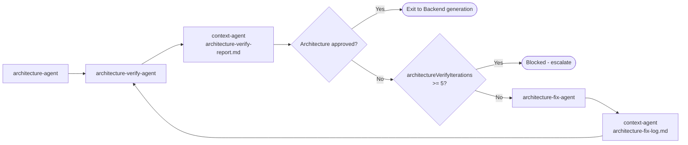

### 3.2 Backend code verification loop

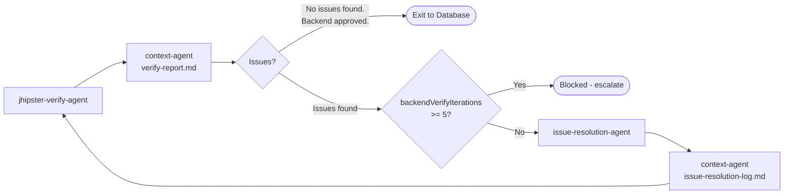

### 3.3 Database loop

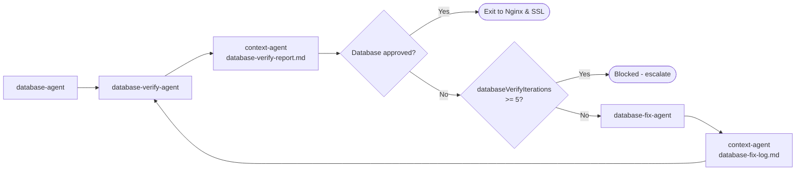

### 3.4 Nginx & SSL edge loop

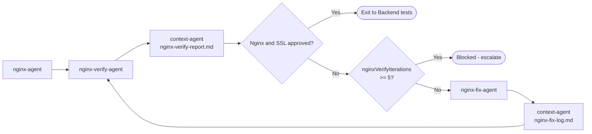

## 4. Backend testing loops (detail)

The three generation agents run **once** in order. Then each layer has its **own verify/fix loop** with its own exit phrase and counter, run in order: unit → integration → functional. Each layer's fix agent only touches that layer.

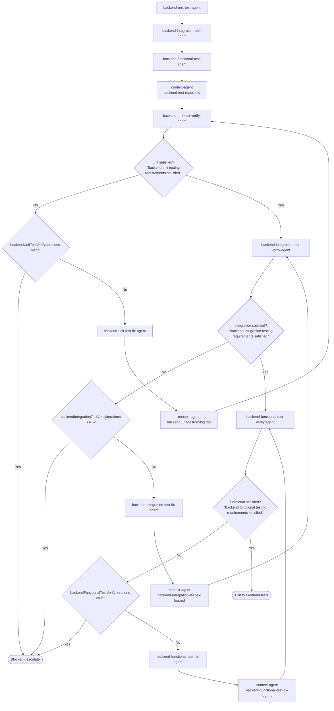

## 5. Frontend testing loops (detail)

Same per-layer structure for the frontend: generate once, then unit → integration/component → functional/E2E, each with its own verify/fix loop, exit phrase, and counter.

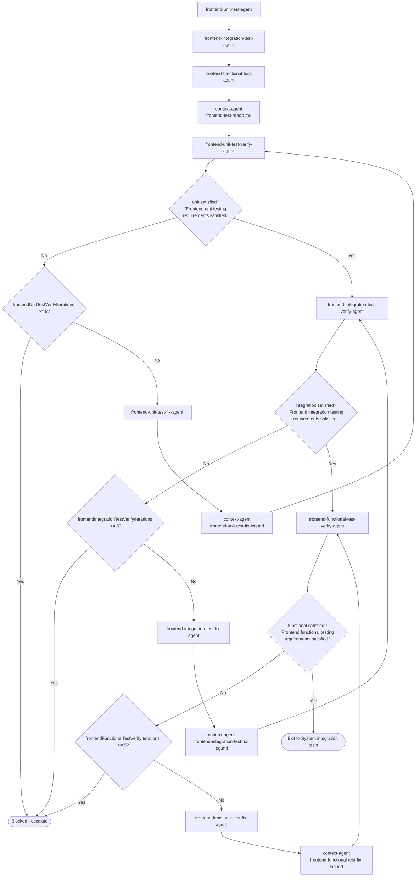

## 5.5 System integration testing loop (detail)

After both backend (§4) and frontend (§5) testing stages are satisfied, the collective full-stack loop runs the **whole system together** — the real frontend driving the real gateway + microservices, persisting to a real **PostgreSQL** database — to validate cross-tier journeys, auth propagation, and persistence. Generate once, then a single verify/fix loop.

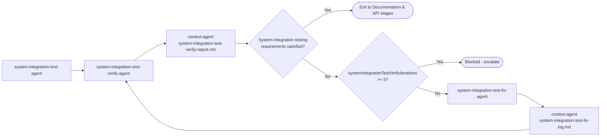

## 5.6 Documentation & API loops (detail)

Five generate → verify → fix loops run **in order** after system integration testing and before production: **Swagger → Javadoc → API collection → API tests → API performance**. Swagger runs first because its exported OpenAPI spec feeds the API collection and API tests. Each loop has its own exit phrase and counter (cap 5).

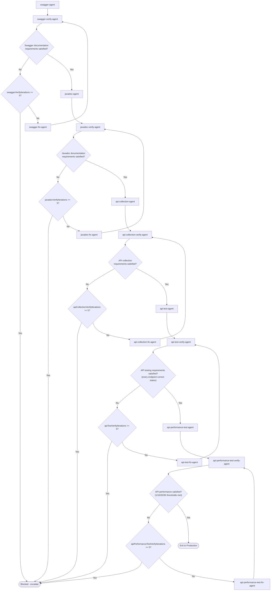

## 6. Production loop (detail)

The production agent first runs a **completeness audit of every prior stage** (each stage's exact verdict present + artifacts on disk — a do's-and-don'ts checklist). If any stage is incomplete it emits `Final approval blocked.` with the gaps; otherwise it audits security/readiness/standards/performance and emits the comprehensive final report.

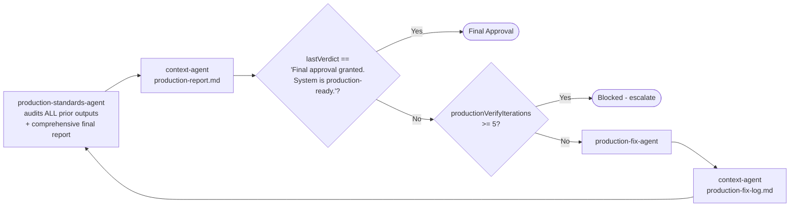

---

## 7. What happens when something fails (fix and re-verify)

Every stage uses the **same failure-handling mechanism**. When a verify/audit agent does not emit its exact exit phrase, the work goes to the matching fix agent, then back for a fresh re-audit — bounded by the 5-iteration cap.

### The rules that make this safe

1. **The fixer cannot mark its own homework.** Only the readonly verify/audit agent can emit the exit phrase. A fix is "accepted" only when an independent re-audit passes.
2. **Re-verification is from scratch.** The verify agent re-audits the real code with no memory of the fixes, so an incomplete fix is caught again.
3. **One round = one iteration.** Each verify run increments that loop's own counter (`architectureVerifyIterations`; `backendVerifyIterations`; `databaseVerifyIterations`; `nginxVerifyIterations`; the six per-layer test counters `backend/frontend{Unit,Integration,Functional}TestVerifyIterations`; `systemIntegrationTestVerifyIterations`; the five documentation/API counters `swaggerVerifyIterations` / `javadocVerifyIterations` / `apiCollectionVerifyIterations` / `apiTestVerifyIterations` / `apiPerformanceTestVerifyIterations`; `productionVerifyIterations`).
4. **The cap is checked before fixing again.** If the counter hits `maxIterations` (default 5) without the exit phrase, Sunny sets `phase: "blocked"`, stops, and hands the remaining blockers to the user — never an infinite loop.
5. **New findings are allowed.** A fix may surface fresh issues; they appear in the next report and are addressed in the next round (while under the cap).
6. **Fixers never weaken controls.** They do not disable auth, loosen CORS to `*`, remove validation, lower coverage thresholds, or introduce mock data to force a pass — they fix the root cause.

### Same mechanism across all seventeen loops

| Loop | Verify / audit agent | Fix agent | Counter | Exit phrase |
|------|----------------------|-----------|---------|-------------|
| Architecture | `architecture-verify-agent` | `architecture-fix-agent` | `architectureVerifyIterations` | `Architecture approved.` |
| Backend code | `jhipster-verify-agent` | `issue-resolution-agent` | `backendVerifyIterations` | `No issues found. Backend approved.` |
| Database | `database-verify-agent` | `database-fix-agent` | `databaseVerifyIterations` | `Database approved.` |
| Nginx & SSL | `nginx-verify-agent` | `nginx-fix-agent` | `nginxVerifyIterations` | `Nginx and SSL approved.` |
| Backend unit tests | `backend-unit-test-verify-agent` | `backend-unit-test-fix-agent` | `backendUnitTestVerifyIterations` | `Backend unit testing requirements satisfied.` |
| Backend integration tests | `backend-integration-test-verify-agent` | `backend-integration-test-fix-agent` | `backendIntegrationTestVerifyIterations` | `Backend integration testing requirements satisfied.` |
| Backend functional tests | `backend-functional-test-verify-agent` | `backend-functional-test-fix-agent` | `backendFunctionalTestVerifyIterations` | `Backend functional testing requirements satisfied.` |
| Frontend unit tests | `frontend-unit-test-verify-agent` | `frontend-unit-test-fix-agent` | `frontendUnitTestVerifyIterations` | `Frontend unit testing requirements satisfied.` |
| Frontend integration tests | `frontend-integration-test-verify-agent` | `frontend-integration-test-fix-agent` | `frontendIntegrationTestVerifyIterations` | `Frontend integration testing requirements satisfied.` |
| Frontend functional tests | `frontend-functional-test-verify-agent` | `frontend-functional-test-fix-agent` | `frontendFunctionalTestVerifyIterations` | `Frontend functional testing requirements satisfied.` |
| System integration tests | `system-integration-test-verify-agent` | `system-integration-test-fix-agent` | `systemIntegrationTestVerifyIterations` | `System integration testing requirements satisfied.` |
| Swagger / OpenAPI | `swagger-verify-agent` | `swagger-fix-agent` | `swaggerVerifyIterations` | `Swagger documentation requirements satisfied.` |
| Javadoc | `javadoc-verify-agent` | `javadoc-fix-agent` | `javadocVerifyIterations` | `Javadoc documentation requirements satisfied.` |
| API collection | `api-collection-verify-agent` | `api-collection-fix-agent` | `apiCollectionVerifyIterations` | `API collection requirements satisfied.` |
| API tests | `api-test-verify-agent` | `api-test-fix-agent` | `apiTestVerifyIterations` | `API testing requirements satisfied.` |
| API performance | `api-performance-test-verify-agent` | `api-performance-test-fix-agent` | `apiPerformanceTestVerifyIterations` | `API performance testing requirements satisfied.` |
| Production | `production-standards-agent` | `production-fix-agent` | `productionVerifyIterations` | `Final approval granted. System is production-ready.` |

> Each side's three generation agents (unit/integration/functional) run once at the start; then each layer has its own verify/fix loop. On failure the layer's fix agent adds or repairs that layer's tests, then the layer re-verifies — the generators are not re-run.

---

## 8. Phase sequence (who talks to whom, when)

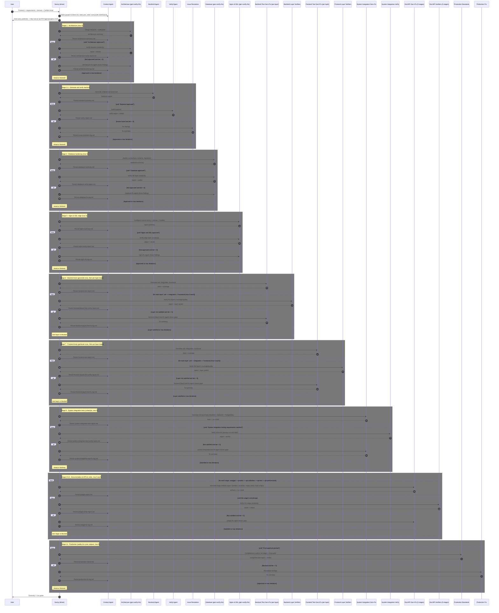

---

## 9. Shared-memory data flow

Only the Context Agent writes the store; every other agent reads trimmed handoffs.

```mermaid
flowchart LR
    subgraph store [".sunny/context/"]
        PC[project-context.md]
        AS[architecture-summary.md]
        AVR[architecture-verify-report.md]
        AFL[architecture-fix-log.md]
        BS[backend-summary.md]
        VR[verify-report.md]
        IRL[issue-resolution-log.md]
        DS[database-summary.md]
        DVR[database-verify-report.md]
        DFL[database-fix-log.md]
        NS[nginx-summary.md]
        NVR[nginx-verify-report.md]
        NFL[nginx-fix-log.md]
        BTR[backend-test-report.md]
        BTV6["backend-{unit,integration,functional}-<br/>test-verify-report.md (x3)"]
        BTF6["backend-{unit,integration,functional}-<br/>test-fix-log.md (x3)"]
        FTR[frontend-test-report.md]
        FTV6["frontend-{unit,integration,functional}-<br/>test-verify-report.md (x3)"]
        FTF6["frontend-{unit,integration,functional}-<br/>test-fix-log.md (x3)"]
        SIR[system-integration-test-report.md]
        SIVR[system-integration-test-verify-report.md]
        SIFL[system-integration-test-fix-log.md]
        DOCV["swagger/javadoc/api-collection/<br/>api-test/api-performance -report.md (x5)"]
        DOCVR["...-verify-report.md (x5)"]
        DOCFL["...-fix-log.md (x5)"]
        PR[production-report.md]
        PFL[production-fix-log.md]
        ST[state.json]
    end

    subgraph web [".sunny/web/ (live dashboard)"]
        HTML[agentprogress.html]
        PJSON[progress.json]
        PUB[docker-compose.yml + nginx-progress.conf]
    end

    Ctx[context-agent] -->|writes| store
    Ctx -->|"writes every handoff"| web
    PJSON -->|"early publisher / Naveen on domain"| Viewer["Browser<br/>agentprogress.html"]

    PC --> ARC[architecture-agent]
    AVR --> ARC
    AS --> ARCV[architecture-verify]
    PC --> ARCV
    AVR --> ARCF[architecture-fix]
    AS --> ARCF
    AFL --> ARCF

    PC --> BE[backend-agent]
    AS --> BE
    PC --> VER[verify-agent]
    BS --> VER
    AS --> VER
    VR --> FIX[issue-resolution]
    BS --> FIX
    IRL --> FIX

    BS --> DBA[database-agent]
    PC --> DBA
    DVR --> DBA
    DS --> DBV[database-verify]
    BS --> DBV
    DVR --> DBF[database-fix]
    DS --> DBF
    DFL --> DBF

    BS --> NGA[nginx-agent]
    DS --> NGA
    AS --> NGA
    PC --> NGA
    NVR --> NGA
    NS --> NGVA[nginx-verify]
    PC --> NGVA
    NVR --> NGFIX[nginx-fix]
    NS --> NGFIX
    NFL --> NGFIX

    BS --> BTEST[backend test gen agents x3]
    PC --> BTEST
    BTV6 --> BTEST
    BTR --> BTVA["backend layer verify agents x3"]
    BS --> BTVA
    BTV6 --> BTFIX["backend layer fix agents x3"]
    BTR --> BTFIX
    BTF6 --> BTFIX
    PC --> FTEST[frontend test gen agents x3]
    FTV6 --> FTEST
    FTR --> FTVA["frontend layer verify agents x3"]
    FTV6 --> FTFIX["frontend layer fix agents x3"]
    FTR --> FTFIX
    FTF6 --> FTFIX

    PC --> SIT[system-integration-test-agent]
    AS --> SIT
    BS --> SIT
    DS --> SIT
    SIVR --> SIT
    SIR --> SIV2[system-integration-verify]
    PC --> SIV2
    SIVR --> SIF2[system-integration-fix]
    SIR --> SIF2
    SIFL --> SIF2

    PC --> DOCGEN[doc/API gen agents x5]
    AS --> DOCGEN
    BS --> DOCGEN
    DOCVR --> DOCGEN
    DOCV --> DOCVA[doc/API verify agents x5]
    DOCVR --> DOCFIX[doc/API fix agents x5]
    DOCV --> DOCFIX
    DOCFL --> DOCFIX

    BTV6 --> PROD["production-standards<br/>(reads ALL files)"]
    FTV6 --> PROD
    SIVR --> PROD
    DOCVR --> PROD
    BS --> PROD
    PR --> PROD
    PR --> PFIX[production-fix]
    BS --> PFIX
    PC --> PFIX
    PFL --> PFIX
    ST -.drives loop decisions.-> Driver[Sunny driver]
```

---

## 10. Workflow state machine

`state.json.phase` transitions that the orchestrator follows.

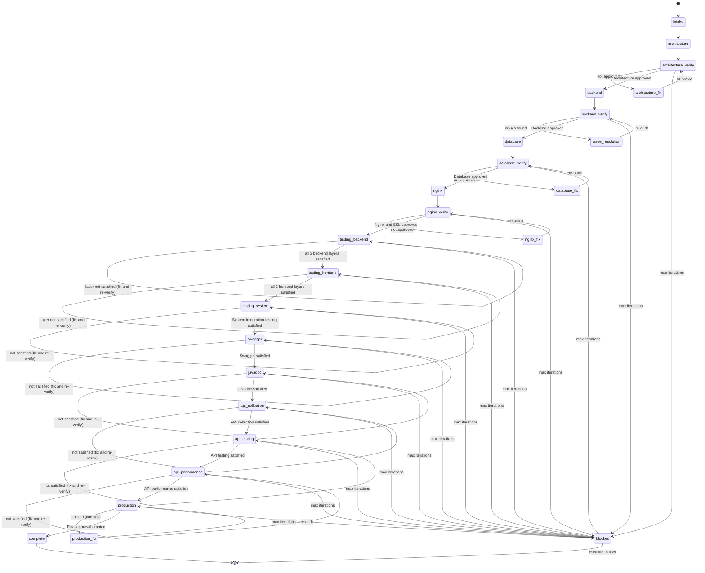

> Within `testing_backend` and `testing_frontend`, the layers are verified/fixed in order — unit → integration → functional — each with its own exit phrase and iteration counter. The side advances only when all three layers are satisfied.

---

## Legend

| Concept | Meaning |
|---------|---------|
| **Driver** | Main chat agent that follows the playbook and launches sub-agents via the Task tool |
| **Solid arrow** | Control flow / Task launch |
| **Dotted arrow** | Data flow (persist / handoff) |
| **readonly agent** | Audits and reports only; makes no code changes (architecture-verify, jhipster-verify, database-verify, nginx-verify, the six per-layer test-verify agents, system-integration-test-verify, the five doc/API verify agents, production-standards) |
| **Exit phrase** | Exact string in `state.json.lastVerdict` that breaks a loop |
| **Architecture exit** | `Architecture approved.` |
| **Backend code exit** | `No issues found. Backend approved.` |
| **Database exit** | `Database approved.` |
| **Nginx & SSL exit** | `Nginx and SSL approved.` |
| **Backend test exits** | `Backend unit testing requirements satisfied.` / `Backend integration testing requirements satisfied.` / `Backend functional testing requirements satisfied.` |
| **Frontend test exits** | `Frontend unit testing requirements satisfied.` / `Frontend integration testing requirements satisfied.` / `Frontend functional testing requirements satisfied.` |
| **System integration exit** | `System integration testing requirements satisfied.` |
| **Doc/API exits** | `Swagger documentation requirements satisfied.` / `Javadoc documentation requirements satisfied.` / `API collection requirements satisfied.` / `API testing requirements satisfied.` / `API performance testing requirements satisfied.` |
| **Production exit** | `Final approval granted. System is production-ready.` |
| **Max iterations** | Default 5 per loop; each loop has its own counter (`architectureVerifyIterations`; `backendVerifyIterations`; `databaseVerifyIterations`; `nginxVerifyIterations`; the six `backend/frontend{Unit,Integration,Functional}TestVerifyIterations`; `systemIntegrationTestVerifyIterations`; the five `swagger/javadoc/apiCollection/apiTest/apiPerformanceTestVerifyIterations`; `productionVerifyIterations`); exceeding it sets `phase = blocked` **before** launching the fix agent again |
