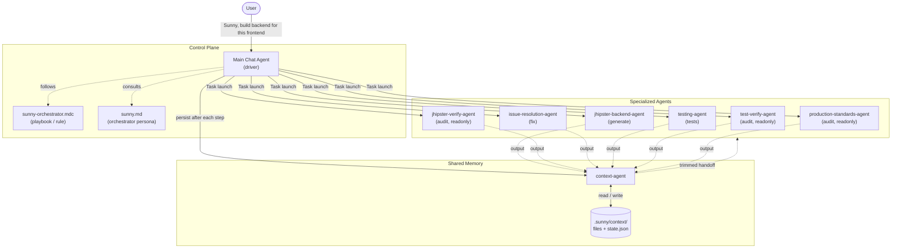
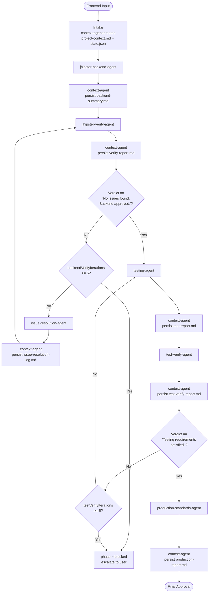
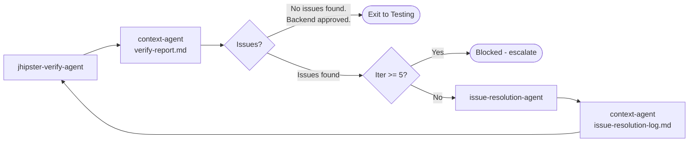
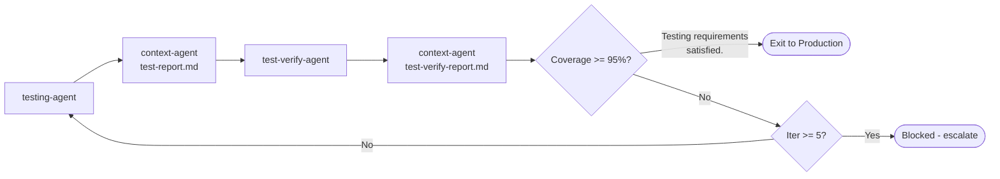
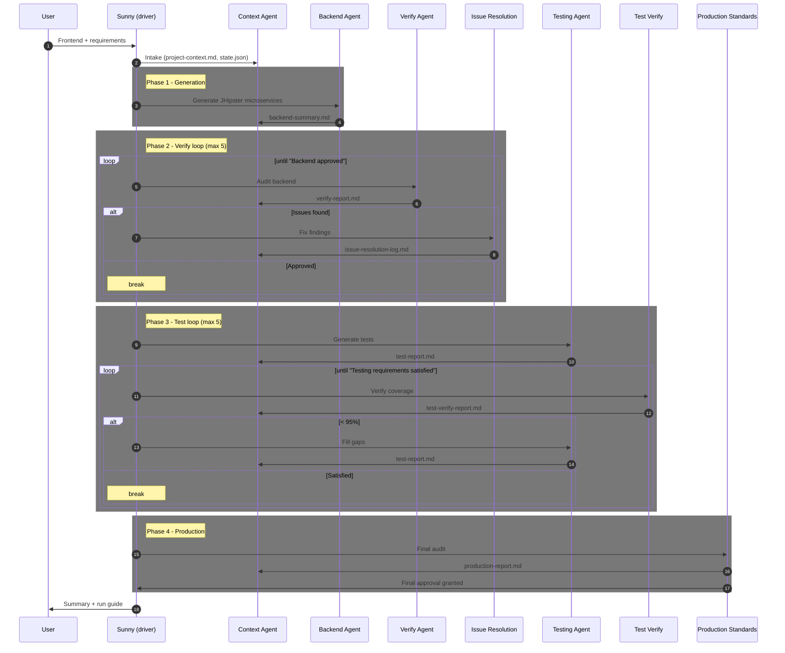
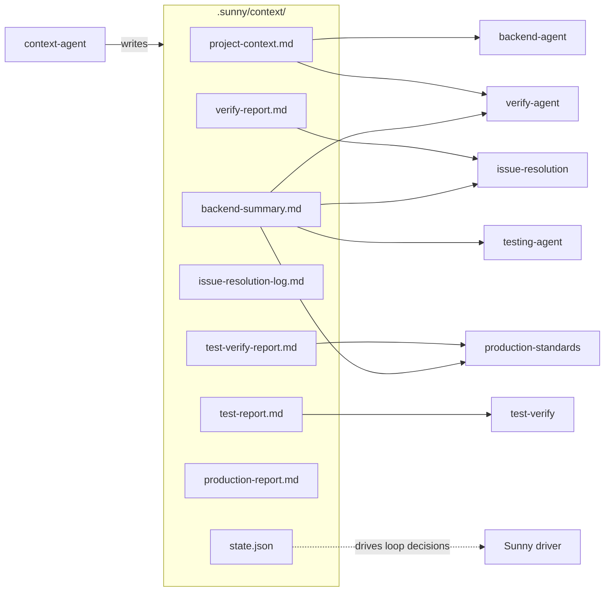
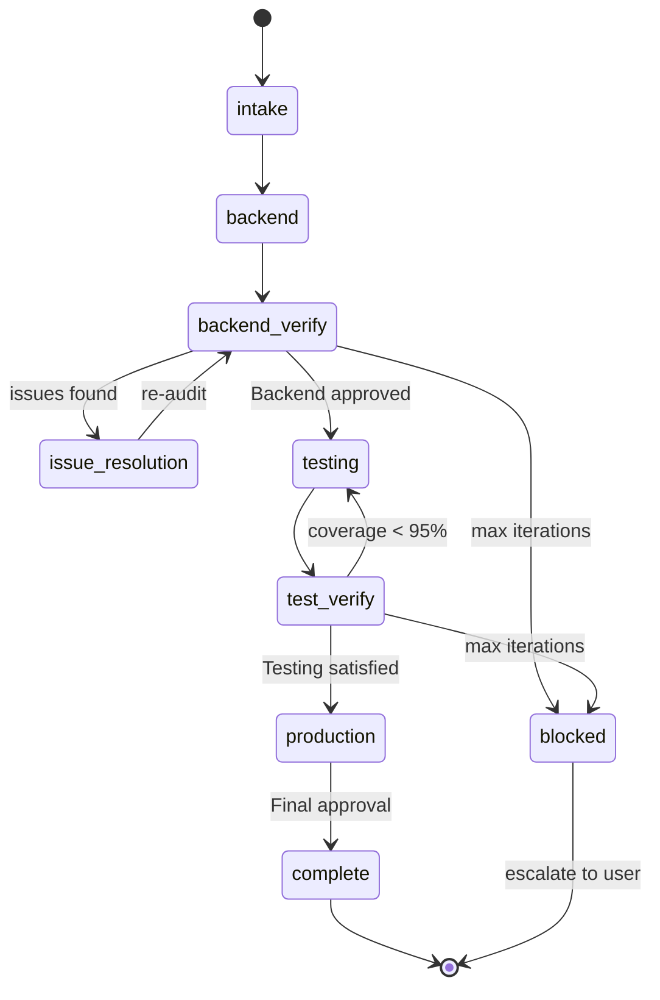

# Sunny Orchestrator — Architecture & Workflow

Visual reference for the Sunny multi-agent system: component architecture, control flow, the two verification loops, shared-memory data flow, and state transitions.

> For prose explanation and run instructions, see [`README.md`](README.md).

---

## 1. System architecture (components)

How the orchestrator, the shared-memory store, and the specialized agents relate.

---

## 2. End-to-end workflow (control flow)

The strict call order with both loops and their exact exit phrases.

---

## 3. Backend verification loop (detail)

## 4. Testing loop (detail)

---

## 5. Phase sequence (who talks to whom, when)

---

## 6. Shared-memory data flow

Only the Context Agent writes the store; every other agent reads trimmed handoffs.

---

## 7. Workflow state machine

`state.json.phase` transitions that the orchestrator follows.

---

## Legend

| Concept | Meaning |
|---------|---------|
| **Driver** | Main chat agent that follows the playbook and launches sub-agents via the Task tool |
| **Solid arrow** | Control flow / Task launch |
| **Dotted arrow** | Data flow (persist / handoff) |
| **readonly agent** | Audits and reports only; makes no code changes (verify, test-verify, production) |
| **Exit phrase** | Exact string the orchestrator matches to break a loop |
| **Max iterations** | Default 5 per loop; exceeding it sets `phase = blocked` |
