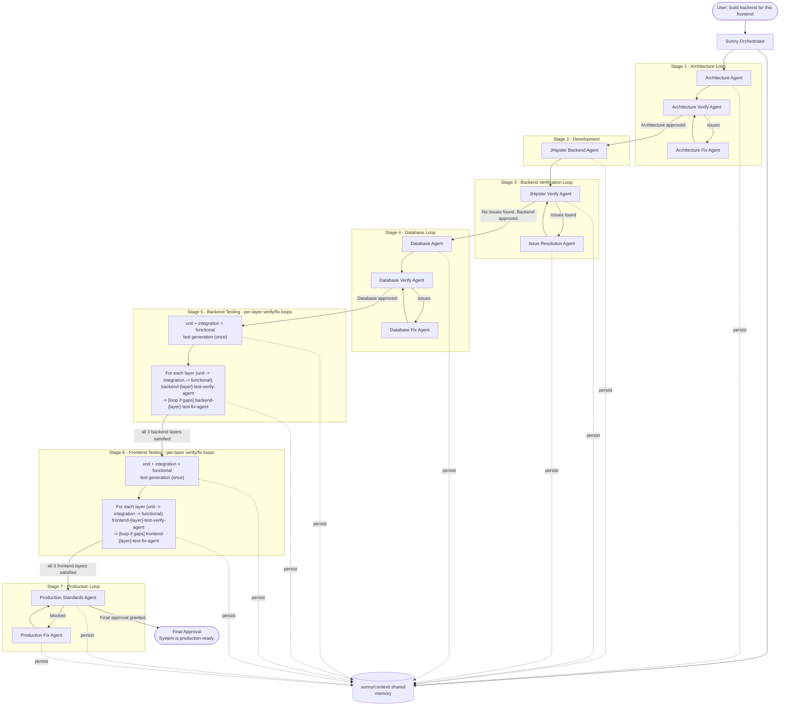
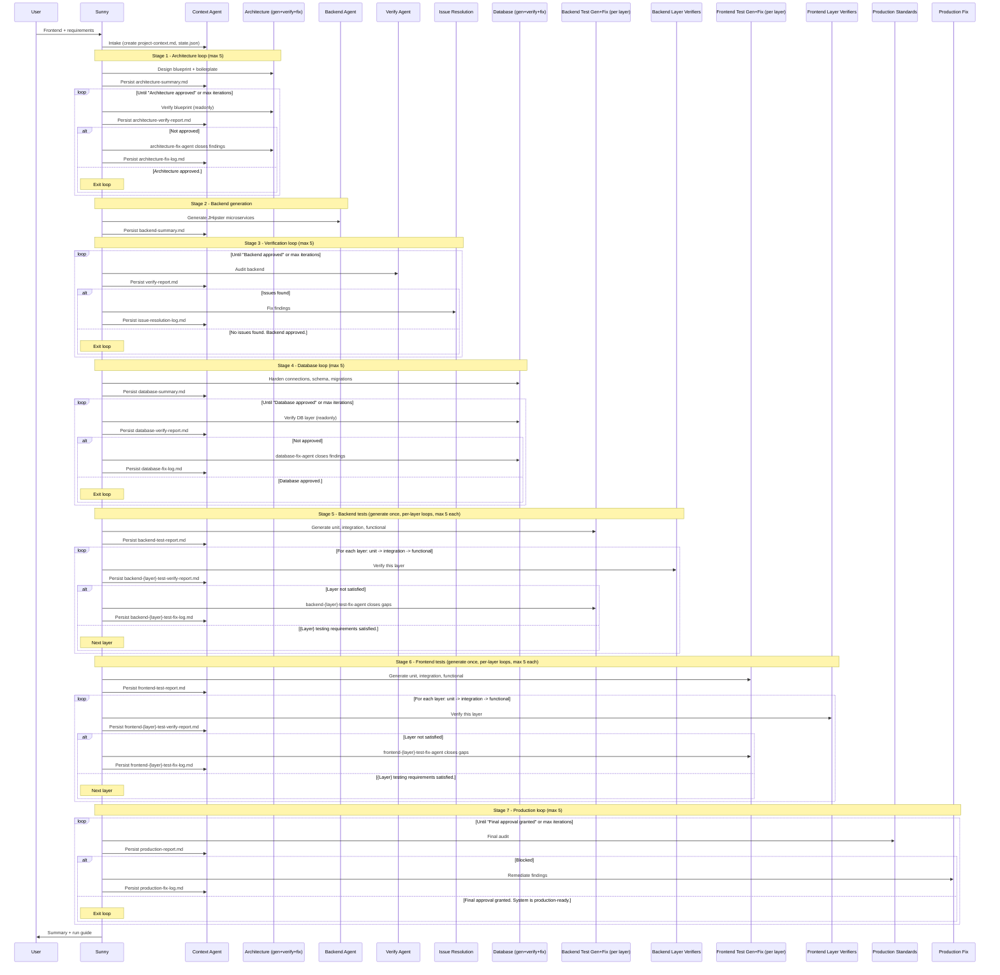

# Sunny Multi-Agent Orchestration System

Sunny is a central **Orchestrator Agent** that coordinates specialized sub-agents to turn a frontend application into a complete, enterprise-grade **JHipster microservices** backend — with verification, testing, and production-readiness loops that run until every quality gate passes.

This document explains how the agents work together, what each one does, and how to run the system.

---

## Non-negotiables

These constraints are enforced by every relevant agent:

- **JHipster microservices** architecture (gateway + services + registry) — never monolithic.
- **PostgreSQL** for all persistent data.
- **No mock data**, no fake CSV files, no dummy records — real database persistence only.
- **>= 95%** line and branch coverage for backend and frontend.
- Enterprise API standards: REST, versioning, OpenAPI, RFC 7807 errors, JWT/OAuth2, RBAC.
- Production readiness: Docker, logging, monitoring, externalized config.

---

## The agents

| # | Agent | File | Role | Readonly |
|---|-------|------|------|----------|
| 1 | **Sunny** (Orchestrator) | `sunny.md` + `../rules/sunny-orchestrator.mdc` | Coordinates all agents, runs loops, enforces gates | No |
| 2 | **Context Agent** | `context-agent.md` | Shared memory; persists summaries to `.sunny/context/` | No |
| 3 | **Architecture Agent** | `architecture-agent.md` | Designs architecture blueprint + boilerplate from the frontend | No |
| 4 | **Architecture Verify Agent** | `architecture-verify-agent.md` | Reviews blueprint, decomposition, API coverage, JDL | Yes |
| 5 | **Architecture Fix Agent** | `architecture-fix-agent.md` | Fixes architecture review findings | No |
| 6 | **JHipster Backend Agent** | `jhipster-backend-agent.md` | Generates the microservices backend | No |
| 7 | **JHipster Verify Agent** | `jhipster-verify-agent.md` | Audits backend (API, security, architecture, DB) | Yes |
| 8 | **Issue Resolution Agent** | `issue-resolution-agent.md` | Fixes issues found by the verify agent | No |
| 9 | **Database Agent** | `database-agent.md` | Hardens DB connections, schema, migrations, standards | No |
| 10 | **Database Verify Agent** | `database-verify-agent.md` | Audits DB layer (schema, migrations, no mock data) | Yes |
| 11 | **Database Fix Agent** | `database-fix-agent.md` | Fixes database review findings | No |
| 12 | **Backend Unit Test Agent** | `backend-unit-test-agent.md` | Isolated unit tests (services, mappers, validators) | No |
| 13 | **Backend Unit Test Verify Agent** | `backend-unit-test-verify-agent.md` | Verifies backend unit-layer coverage/quality | Yes |
| 14 | **Backend Unit Test Fix Agent** | `backend-unit-test-fix-agent.md` | Closes backend unit-layer gaps | No |
| 15 | **Backend Integration Test Agent** | `backend-integration-test-agent.md` | Repository/DB tests on Testcontainers PostgreSQL | No |
| 16 | **Backend Integration Test Verify Agent** | `backend-integration-test-verify-agent.md` | Verifies backend integration-layer coverage/quality | Yes |
| 17 | **Backend Integration Test Fix Agent** | `backend-integration-test-fix-agent.md` | Closes backend integration-layer gaps | No |
| 18 | **Backend Functional Test Agent** | `backend-functional-test-agent.md` | REST/API + gateway HTTP contract tests | No |
| 19 | **Backend Functional Test Verify Agent** | `backend-functional-test-verify-agent.md` | Verifies backend functional-layer coverage/quality | Yes |
| 20 | **Backend Functional Test Fix Agent** | `backend-functional-test-fix-agent.md` | Closes backend functional-layer gaps | No |
| 21 | **Frontend Unit Test Agent** | `frontend-unit-test-agent.md` | Isolated unit tests (utils, hooks, stores) | No |
| 22 | **Frontend Unit Test Verify Agent** | `frontend-unit-test-verify-agent.md` | Verifies frontend unit-layer coverage/quality | Yes |
| 23 | **Frontend Unit Test Fix Agent** | `frontend-unit-test-fix-agent.md` | Closes frontend unit-layer gaps | No |
| 24 | **Frontend Integration Test Agent** | `frontend-integration-test-agent.md` | Component/page tests with MSW, routing, state | No |
| 25 | **Frontend Integration Test Verify Agent** | `frontend-integration-test-verify-agent.md` | Verifies frontend component-layer coverage/quality | Yes |
| 26 | **Frontend Integration Test Fix Agent** | `frontend-integration-test-fix-agent.md` | Closes frontend component-layer gaps | No |
| 27 | **Frontend Functional Test Agent** | `frontend-functional-test-agent.md` | E2E user journeys (Playwright) | No |
| 28 | **Frontend Functional Test Verify Agent** | `frontend-functional-test-verify-agent.md` | Verifies frontend E2E journey coverage | Yes |
| 29 | **Frontend Functional Test Fix Agent** | `frontend-functional-test-fix-agent.md` | Closes frontend E2E gaps | No |
| 30 | **Production Standards Agent** | `production-standards-agent.md` | Final security/readiness/performance audit | Yes |
| 31 | **Production Fix Agent** | `production-fix-agent.md` | Remediates production audit findings | No |

---

## How it works

Cursor sub-agents run in **isolation** and are launched via the Task tool. Because an isolated sub-agent has no memory of previous runs, all state lives in a **file-based context store** owned by the Context Agent. The main chat agent acts as the orchestration driver, following the playbook in `../rules/sunny-orchestrator.mdc`.

The golden rule: **after every agent runs, the Context Agent persists its output before the next agent starts.** No agent assumes in-memory state from a previous step.

> For the full set of architecture, loop, data-flow, and state-machine diagrams, see [`ARCHITECTURE.md`](ARCHITECTURE.md).



---

## Phase-by-phase workflow



---

## Loop control and exit phrases

The orchestrator looks for **exact** verdict phrases to exit each loop:

| Loop | Exit phrase | Driven by |
|------|-------------|-----------|
| Architecture | `Architecture approved.` | Architecture Verify Agent |
| Backend verification | `No issues found. Backend approved.` | JHipster Verify Agent |
| Database | `Database approved.` | Database Verify Agent |
| Backend unit testing | `Backend unit testing requirements satisfied.` | Backend Unit Test Verify Agent |
| Backend integration testing | `Backend integration testing requirements satisfied.` | Backend Integration Test Verify Agent |
| Backend functional testing | `Backend functional testing requirements satisfied.` | Backend Functional Test Verify Agent |
| Frontend unit testing | `Frontend unit testing requirements satisfied.` | Frontend Unit Test Verify Agent |
| Frontend integration testing | `Frontend integration testing requirements satisfied.` | Frontend Integration Test Verify Agent |
| Frontend functional testing | `Frontend functional testing requirements satisfied.` | Frontend Functional Test Verify Agent |
| Production | `Final approval granted. System is production-ready.` | Production Standards Agent |

Each loop has a **max-iteration cap (default 5)** tracked in `state.json`. Each loop has its own counter: `architectureVerifyIterations`; `backendVerifyIterations`; `databaseVerifyIterations`; the six per-layer test counters (`backendUnitTestVerifyIterations`, `backendIntegrationTestVerifyIterations`, `backendFunctionalTestVerifyIterations`, `frontendUnitTestVerifyIterations`, `frontendIntegrationTestVerifyIterations`, `frontendFunctionalTestVerifyIterations`); and `productionVerifyIterations`. Stages run in order (architecture → backend → database → backend tests → frontend tests → production); within a side the layers run in order (unit → integration → functional). If any loop hits the cap without its exit phrase, Sunny sets `phase: "blocked"`, records the blockers, stops, and escalates to the user instead of looping forever.

---

## Shared memory (`.sunny/context/`)

Created and maintained at runtime by the Context Agent. Other agents **read** from it; only the Context Agent **writes** to it.

```
.sunny/context/
├── project-context.md             # Frontend-derived domain model, API contract, auth, requirements
├── architecture-summary.md        # Architecture blueprint + boilerplate
├── architecture-verify-report.md  # Architecture review findings + verdict
├── architecture-fix-log.md        # History of architecture fix cycles
├── backend-summary.md             # Backend generation output
├── verify-report.md               # Latest backend verification findings + verdict
├── issue-resolution-log.md        # History of backend code fix cycles
├── database-summary.md            # Database hardening output
├── database-verify-report.md      # Database audit findings + verdict
├── database-fix-log.md            # History of database fix cycles
├── backend-test-report.md         # Backend test generation output + coverage
├── backend-unit-test-verify-report.md         # Backend unit-layer verify findings + verdict
├── backend-unit-test-fix-log.md               # History of backend unit-layer fix cycles
├── backend-integration-test-verify-report.md  # Backend integration-layer verify findings + verdict
├── backend-integration-test-fix-log.md        # History of backend integration-layer fix cycles
├── backend-functional-test-verify-report.md   # Backend functional-layer verify findings + verdict
├── backend-functional-test-fix-log.md         # History of backend functional-layer fix cycles
├── frontend-test-report.md        # Frontend test generation output + coverage
├── frontend-unit-test-verify-report.md        # Frontend unit-layer verify findings + verdict
├── frontend-unit-test-fix-log.md              # History of frontend unit-layer fix cycles
├── frontend-integration-test-verify-report.md # Frontend component-layer verify findings + verdict
├── frontend-integration-test-fix-log.md       # History of frontend component-layer fix cycles
├── frontend-functional-test-verify-report.md  # Frontend E2E-layer verify findings + verdict
├── frontend-functional-test-fix-log.md        # History of frontend E2E-layer fix cycles
├── production-report.md           # Latest production audit findings + verdict
├── production-fix-log.md          # History of production remediation cycles
└── state.json                     # phase, loop counters, lastVerdict, blockers
```

### `state.json` drives the loops

```json
{
  "workflowId": "...",
  "phase": "testing_backend",
  "architectureVerifyIterations": 1,
  "backendVerifyIterations": 2,
  "databaseVerifyIterations": 1,
  "backendUnitTestVerifyIterations": 1,
  "backendIntegrationTestVerifyIterations": 0,
  "backendFunctionalTestVerifyIterations": 0,
  "frontendUnitTestVerifyIterations": 0,
  "frontendIntegrationTestVerifyIterations": 0,
  "frontendFunctionalTestVerifyIterations": 0,
  "productionVerifyIterations": 0,
  "maxIterations": 5,
  "lastVerdict": "Backend unit testing requirements not met.",
  "blockers": [],
  "completedAgents": ["context-agent", "jhipster-backend-agent", "jhipster-verify-agent"],
  "updatedAt": "2026-06-12T06:20:00Z"
}
```

---

## How to run it

1. **Invoke Sunny** in a Cursor chat, pointing at your frontend:

   > Sunny, build the JHipster microservices backend for the frontend in `./frontend`.

2. The main agent loads `../rules/sunny-orchestrator.mdc` and drives the workflow:
   - Analyzes the frontend and runs intake through the Context Agent.
   - Generates the backend, then loops verify ↔ fix until approved.
   - Generates tests, then loops test ↔ verify until coverage is satisfied.
   - Runs the final production audit.

3. **Watch progress** via Sunny's phase announcements (e.g. "Starting backend verification, iteration 2/5") and the contents of `.sunny/context/`.

4. **On completion**, Sunny delivers a summary: architecture, services, coverage, security posture, and a run guide. On a blocked loop, Sunny lists the blockers and asks how to proceed.

---

## Design notes

- **Why a rule + an agent file for Sunny?** The `.mdc` rule is the executable playbook the main chat agent (which reliably has the Task tool) follows. The `sunny.md` agent file documents the persona and can be invoked directly to produce the next orchestration step.
- **Why a file-based Context Agent?** Sub-agents are isolated and context windows are limited. Persisting trimmed, structured summaries to disk lets long-running, multi-loop workflows survive across many isolated agent runs without losing critical decisions.
- **Why readonly verify/audit agents?** Verification must be objective and side-effect free. The architecture-verify agent, JHipster verify agent, database-verify agent, the six per-layer test-verify agents, and the production-standards agent only read and report; fixes are made exclusively by the generation and fix agents (Architecture Fix, Issue Resolution, Database Fix, the six per-layer test fix agents, and Production Fix).
- **Why split testing into per-layer verify and fix agents?** Each test layer (unit, integration, functional) has different tools, isolation rules, and failure modes. A dedicated verify agent audits exactly one layer and routes layer-tagged findings to a matching fix agent, so gaps are closed precisely without one giant agent juggling all layers at once.

---

## Standalone agents (not part of Sunny)

These live alongside the Sunny agents but run on demand and are **not** invoked by the orchestrator:

| Agent | File | Role |
|-------|------|------|
| **Documentation** | `documentation.md` | Complete Swagger/OpenAPI docs, Postman collections + environments (Newman CI), and Javadoc for a Spring Boot / JHipster codebase — leaving nothing undocumented. |
