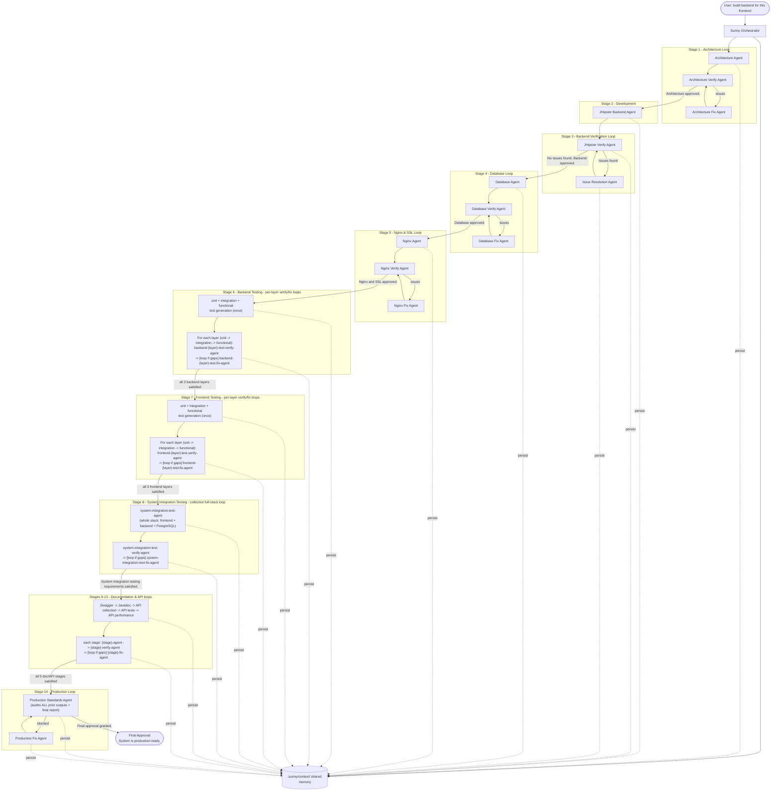
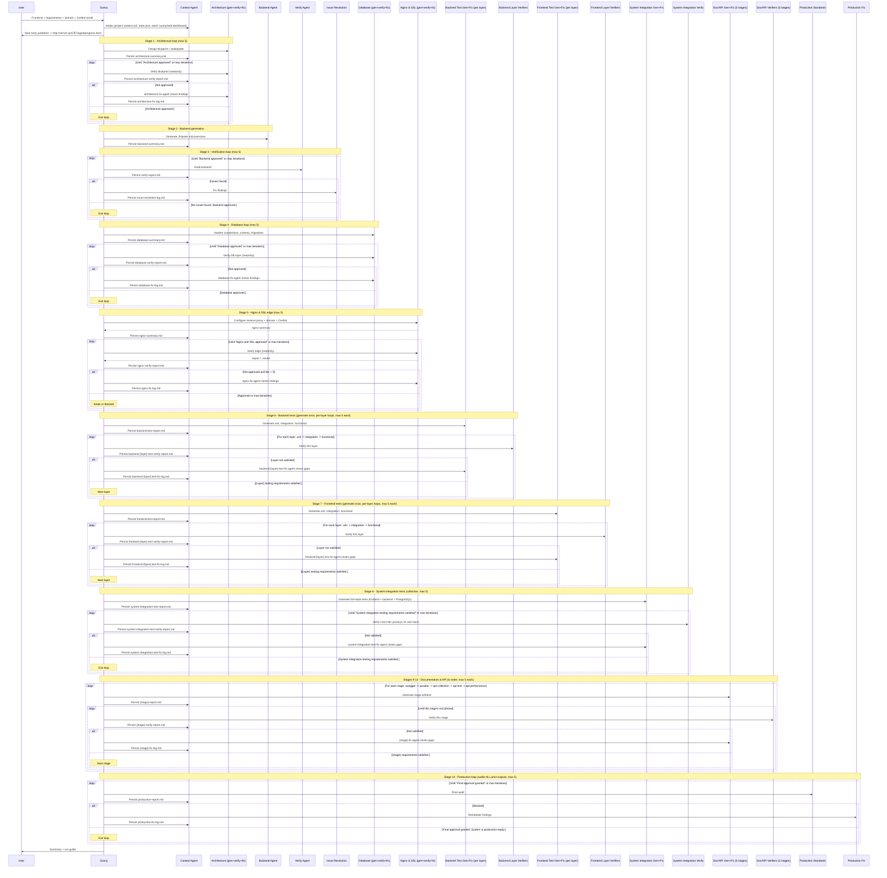

# Sunny Multi-Agent Orchestration System

Sunny is a central **Orchestrator Agent** that coordinates specialized sub-agents to turn a frontend application into a complete, enterprise-grade **JHipster microservices** backend — with verification, testing, and production-readiness loops that run until every quality gate passes.

This document explains how the agents work together, what each one does, and how to run the system. For a dedicated per-agent reference (every agent's job, inputs/outputs, and exit phrase), see [`AGENT-GUIDE.md`](AGENT-GUIDE.md); for all diagrams see [`ARCHITECTURE.md`](ARCHITECTURE.md).

---

## Non-negotiables

These constraints are enforced by every relevant agent:

- **JHipster microservices** architecture (gateway + services + registry) — never monolithic.
- **PostgreSQL** for all persistent data.
- **No mock data**, no fake CSV files, no dummy records — real database persistence only.
- **>= 95%** line and branch coverage for backend and frontend.
- Enterprise API standards: REST, versioning, OpenAPI, RFC 7807 errors, JWT/OAuth2, RBAC.
- Production readiness: Docker, logging, monitoring, externalized config.

---

## The agents

| # | Agent | File | Role | Readonly |
|---|-------|------|------|----------|
| 1 | **Sunny** (Orchestrator) | `sunny.md` + `../rules/sunny-orchestrator.mdc` | Coordinates all agents, runs loops, enforces gates | No |
| 2 | **Context Agent** | `context-agent.md` | Shared memory; persists summaries to `.sunny/context/` | No |
| 3 | **Architecture Agent** | `architecture-agent.md` | Designs architecture blueprint + boilerplate from the frontend | No |
| 4 | **Architecture Verify Agent** | `architecture-verify-agent.md` | Reviews blueprint, decomposition, API coverage, JDL | Yes |
| 5 | **Architecture Fix Agent** | `architecture-fix-agent.md` | Fixes architecture review findings | No |
| 6 | **JHipster Backend Agent** | `jhipster-backend-agent.md` | Generates the microservices backend | No |
| 7 | **JHipster Verify Agent** | `jhipster-verify-agent.md` | Audits backend (API, security, architecture, DB) | Yes |
| 8 | **Issue Resolution Agent** | `issue-resolution-agent.md` | Fixes issues found by the verify agent | No |
| 9 | **Database Agent** | `database-agent.md` | Hardens DB connections, schema, migrations, standards | No |
| 10 | **Database Verify Agent** | `database-verify-agent.md` | Audits DB layer (schema, migrations, no mock data) | Yes |
| 11 | **Database Fix Agent** | `database-fix-agent.md` | Fixes database review findings | No |
| 12 | **Nginx & SSL Edge Agent** | `nginx-agent.md` | Reverse proxy + domain + Certbot/Let's Encrypt | No |
| 13 | **Nginx Verify Agent** | `nginx-verify-agent.md` | Audits edge proxy, HTTPS, cert renewal | Yes |
| 14 | **Nginx Fix Agent** | `nginx-fix-agent.md` | Fixes nginx/SSL findings | No |
| 15 | **Backend Unit Test Agent** | `backend-unit-test-agent.md` | Isolated unit tests (services, mappers, validators) | No |
| 16 | **Backend Unit Test Verify Agent** | `backend-unit-test-verify-agent.md` | Verifies backend unit-layer coverage/quality | Yes |
| 17 | **Backend Unit Test Fix Agent** | `backend-unit-test-fix-agent.md` | Closes backend unit-layer gaps | No |
| 18 | **Backend Integration Test Agent** | `backend-integration-test-agent.md` | Repository/DB tests on Testcontainers PostgreSQL | No |
| 19 | **Backend Integration Test Verify Agent** | `backend-integration-test-verify-agent.md` | Verifies backend integration-layer coverage/quality | Yes |
| 20 | **Backend Integration Test Fix Agent** | `backend-integration-test-fix-agent.md` | Closes backend integration-layer gaps | No |
| 21 | **Backend Functional Test Agent** | `backend-functional-test-agent.md` | REST/API + gateway HTTP contract tests | No |
| 22 | **Backend Functional Test Verify Agent** | `backend-functional-test-verify-agent.md` | Verifies backend functional-layer coverage/quality | Yes |
| 23 | **Backend Functional Test Fix Agent** | `backend-functional-test-fix-agent.md` | Closes backend functional-layer gaps | No |
| 24 | **Frontend Unit Test Agent** | `frontend-unit-test-agent.md` | Isolated unit tests (utils, hooks, stores) | No |
| 25 | **Frontend Unit Test Verify Agent** | `frontend-unit-test-verify-agent.md` | Verifies frontend unit-layer coverage/quality | Yes |
| 26 | **Frontend Unit Test Fix Agent** | `frontend-unit-test-fix-agent.md` | Closes frontend unit-layer gaps | No |
| 27 | **Frontend Integration Test Agent** | `frontend-integration-test-agent.md` | Component/page tests with MSW, routing, state | No |
| 28 | **Frontend Integration Test Verify Agent** | `frontend-integration-test-verify-agent.md` | Verifies frontend component-layer coverage/quality | Yes |
| 29 | **Frontend Integration Test Fix Agent** | `frontend-integration-test-fix-agent.md` | Closes frontend component-layer gaps | No |
| 30 | **Frontend Functional Test Agent** | `frontend-functional-test-agent.md` | E2E user journeys (Playwright) | No |
| 31 | **Frontend Functional Test Verify Agent** | `frontend-functional-test-verify-agent.md` | Verifies frontend E2E journey coverage | Yes |
| 32 | **Frontend Functional Test Fix Agent** | `frontend-functional-test-fix-agent.md` | Closes frontend E2E gaps | No |
| 33 | **System Integration Test Agent** | `system-integration-test-agent.md` | Collective full-stack tests (frontend + backend + PostgreSQL together) | No |
| 34 | **System Integration Test Verify Agent** | `system-integration-test-verify-agent.md` | Verifies cross-tier journey coverage on the real running stack | Yes |
| 35 | **System Integration Test Fix Agent** | `system-integration-test-fix-agent.md` | Closes collective full-stack testing gaps | No |
| 36 | **Swagger Agent** | `swagger-agent.md` | OpenAPI/Swagger docs for every endpoint (springdoc) | No |
| 37 | **Swagger Verify Agent** | `swagger-verify-agent.md` | Verifies spec completeness and accuracy | Yes |
| 38 | **Swagger Fix Agent** | `swagger-fix-agent.md` | Closes Swagger documentation gaps | No |
| 39 | **Javadoc Agent** | `javadoc-agent.md` | Javadoc for every public Java API; failOnWarnings build | No |
| 40 | **Javadoc Verify Agent** | `javadoc-verify-agent.md` | Verifies Javadoc coverage and clean build | Yes |
| 41 | **Javadoc Fix Agent** | `javadoc-fix-agent.md` | Closes Javadoc gaps | No |
| 42 | **API Collection Agent** | `api-collection-agent.md` | Postman collection + environments from the spec (Newman CI) | No |
| 43 | **API Collection Verify Agent** | `api-collection-verify-agent.md` | Verifies collection coverage and green Newman run | Yes |
| 44 | **API Collection Fix Agent** | `api-collection-fix-agent.md` | Closes API collection gaps | No |
| 45 | **API Test Agent** | `api-test-agent.md` | Exercises every endpoint; asserts correct/appropriate status | No |
| 46 | **API Test Verify Agent** | `api-test-verify-agent.md` | Verifies every endpoint returns its correct status | Yes |
| 47 | **API Test Fix Agent** | `api-test-fix-agent.md` | Fixes wrong-status endpoints + missing assertions | No |
| 48 | **API Performance Test Agent** | `api-performance-test-agent.md` | Load test at 1/10/20/30 concurrency; capture metrics | No |
| 49 | **API Performance Test Verify Agent** | `api-performance-test-verify-agent.md` | Verifies all levels covered + thresholds met | Yes |
| 50 | **API Performance Test Fix Agent** | `api-performance-test-fix-agent.md` | Remediates performance breaches | No |
| 51 | **Production Standards Agent** | `production-standards-agent.md` | Audits all prior outputs + final security/readiness audit + comprehensive report | Yes |
| 52 | **Production Fix Agent** | `production-fix-agent.md` | Remediates production audit findings | No |

---

## Agent codenames

Every agent has a human codename. A family shares a base name and its verify/fix variants add `Verify`/`Fix` — e.g. **Vikram** (`jhipster-backend-agent`), **Vikram Verify** (`jhipster-verify-agent`), **Vikram Fix** (`issue-resolution-agent`).

| Family | Generate | Verify (readonly) | Fix |
|--------|----------|-------------------|-----|
| Arjun (architecture) | Arjun — `architecture-agent` | Arjun Verify — `architecture-verify-agent` | Arjun Fix — `architecture-fix-agent` |
| Vikram (backend build) | Vikram — `jhipster-backend-agent` | Vikram Verify — `jhipster-verify-agent` | Vikram Fix — `issue-resolution-agent` |
| Dhruv (database) | Dhruv — `database-agent` | Dhruv Verify — `database-verify-agent` | Dhruv Fix — `database-fix-agent` |
| Naveen (nginx & SSL) | Naveen — `nginx-agent` | Naveen Verify — `nginx-verify-agent` | Naveen Fix — `nginx-fix-agent` |
| Rohan (backend unit) | Rohan — `backend-unit-test-agent` | Rohan Verify — `backend-unit-test-verify-agent` | Rohan Fix — `backend-unit-test-fix-agent` |
| Karan (backend integration) | Karan — `backend-integration-test-agent` | Karan Verify — `backend-integration-test-verify-agent` | Karan Fix — `backend-integration-test-fix-agent` |
| Aditya (backend functional) | Aditya — `backend-functional-test-agent` | Aditya Verify — `backend-functional-test-verify-agent` | Aditya Fix — `backend-functional-test-fix-agent` |
| Priya (frontend unit) | Priya — `frontend-unit-test-agent` | Priya Verify — `frontend-unit-test-verify-agent` | Priya Fix — `frontend-unit-test-fix-agent` |
| Neha (frontend integration) | Neha — `frontend-integration-test-agent` | Neha Verify — `frontend-integration-test-verify-agent` | Neha Fix — `frontend-integration-test-fix-agent` |
| Anika (frontend functional) | Anika — `frontend-functional-test-agent` | Anika Verify — `frontend-functional-test-verify-agent` | Anika Fix — `frontend-functional-test-fix-agent` |
| Sanjay (system integration) | Sanjay — `system-integration-test-agent` | Sanjay Verify — `system-integration-test-verify-agent` | Sanjay Fix — `system-integration-test-fix-agent` |
| Surya (Swagger) | Surya — `swagger-agent` | Surya Verify — `swagger-verify-agent` | Surya Fix — `swagger-fix-agent` |
| Jaya (Javadoc) | Jaya — `javadoc-agent` | Jaya Verify — `javadoc-verify-agent` | Jaya Fix — `javadoc-fix-agent` |
| Chetan (API collection) | Chetan — `api-collection-agent` | Chetan Verify — `api-collection-verify-agent` | Chetan Fix — `api-collection-fix-agent` |
| Tara (API tests) | Tara — `api-test-agent` | Tara Verify — `api-test-verify-agent` | Tara Fix — `api-test-fix-agent` |
| Pawan (API performance) | Pawan — `api-performance-test-agent` | Pawan Verify — `api-performance-test-verify-agent` | Pawan Fix — `api-performance-test-fix-agent` |
| Prakash (production) | — | Prakash — `production-standards-agent` | Prakash Fix — `production-fix-agent` |

**Singletons:** Sunny — `sunny` (orchestrator) · Maya — `context-agent` (shared memory) · Deepa — `documentation` (standalone).

---

## How it works

Cursor sub-agents run in **isolation** and are launched via the Task tool. Because an isolated sub-agent has no memory of previous runs, all state lives in a **file-based context store** owned by the Context Agent. The main chat agent acts as the orchestration driver, following the playbook in `../rules/sunny-orchestrator.mdc`.

The golden rule: **after every agent runs, the Context Agent persists its output before the next agent starts.** No agent assumes in-memory state from a previous step.

**Graphify:** operators pre-install graphify (`uv tool install graphifyy`); agents query `graphify-out/` first and run `graphify update` after code changes. See [`../rules/graphify.mdc`](../rules/graphify.mdc).

> For the full set of architecture, loop, data-flow, and state-machine diagrams, see [`ARCHITECTURE.md`](ARCHITECTURE.md).



---

## Phase-by-phase workflow



---

## Loop control and exit phrases

The orchestrator looks for **exact** verdict phrases to exit each loop:

| Loop | Exit phrase | Driven by |
|------|-------------|-----------|
| Architecture | `Architecture approved.` | Architecture Verify Agent |
| Backend verification | `No issues found. Backend approved.` | JHipster Verify Agent |
| Database | `Database approved.` | Database Verify Agent |
| Nginx & SSL | `Nginx and SSL approved.` | Nginx Verify Agent |
| Backend unit testing | `Backend unit testing requirements satisfied.` | Backend Unit Test Verify Agent |
| Backend integration testing | `Backend integration testing requirements satisfied.` | Backend Integration Test Verify Agent |
| Backend functional testing | `Backend functional testing requirements satisfied.` | Backend Functional Test Verify Agent |
| Frontend unit testing | `Frontend unit testing requirements satisfied.` | Frontend Unit Test Verify Agent |
| Frontend integration testing | `Frontend integration testing requirements satisfied.` | Frontend Integration Test Verify Agent |
| Frontend functional testing | `Frontend functional testing requirements satisfied.` | Frontend Functional Test Verify Agent |
| System integration testing | `System integration testing requirements satisfied.` | System Integration Test Verify Agent |
| Swagger / OpenAPI | `Swagger documentation requirements satisfied.` | Swagger Verify Agent |
| Javadoc | `Javadoc documentation requirements satisfied.` | Javadoc Verify Agent |
| API collection | `API collection requirements satisfied.` | API Collection Verify Agent |
| API tests | `API testing requirements satisfied.` | API Test Verify Agent |
| API performance | `API performance testing requirements satisfied.` | API Performance Test Verify Agent |
| Production | `Final approval granted. System is production-ready.` | Production Standards Agent |

Each loop has a **max-iteration cap (default 5)** tracked in `state.json`. Each loop has its own counter: `architectureVerifyIterations`; `backendVerifyIterations`; `databaseVerifyIterations`; `nginxVerifyIterations`; the six per-layer test counters (`backendUnitTestVerifyIterations`, `backendIntegrationTestVerifyIterations`, `backendFunctionalTestVerifyIterations`, `frontendUnitTestVerifyIterations`, `frontendIntegrationTestVerifyIterations`, `frontendFunctionalTestVerifyIterations`); `systemIntegrationTestVerifyIterations`; the five documentation/API counters (`swaggerVerifyIterations`, `javadocVerifyIterations`, `apiCollectionVerifyIterations`, `apiTestVerifyIterations`, `apiPerformanceTestVerifyIterations`); and `productionVerifyIterations`. Stages run in order (architecture → backend → database → nginx & SSL → backend tests → frontend tests → system integration tests → Swagger → Javadoc → API collection → API tests → API performance → production); within a side the layers run in order (unit → integration → functional). If any loop hits the cap without its exit phrase, Sunny sets `phase: "blocked"`, records the blockers, stops, and escalates to the user instead of looping forever.

---

## Shared memory (`.sunny/context/`)

Created and maintained at runtime by the Context Agent. Other agents **read** from it; only the Context Agent **writes** to it.

```
.sunny/context/
├── project-context.md             # Frontend-derived domain model, API contract, auth, requirements
├── architecture-summary.md        # Architecture blueprint + boilerplate
├── architecture-verify-report.md  # Architecture review findings + verdict
├── architecture-fix-log.md        # History of architecture fix cycles
├── backend-summary.md             # Backend generation output
├── verify-report.md               # Latest backend verification findings + verdict
├── issue-resolution-log.md        # History of backend code fix cycles
├── database-summary.md            # Database hardening output
├── database-verify-report.md      # Database audit findings + verdict
├── database-fix-log.md            # History of database fix cycles
├── nginx-summary.md               # Nginx reverse proxy + TLS/Certbot output
├── nginx-verify-report.md         # Nginx edge audit findings + verdict
├── nginx-fix-log.md               # History of nginx/SSL fix cycles
├── backend-test-report.md         # Backend test generation output + coverage
├── backend-unit-test-verify-report.md         # Backend unit-layer verify findings + verdict
├── backend-unit-test-fix-log.md               # History of backend unit-layer fix cycles
├── backend-integration-test-verify-report.md  # Backend integration-layer verify findings + verdict
├── backend-integration-test-fix-log.md        # History of backend integration-layer fix cycles
├── backend-functional-test-verify-report.md   # Backend functional-layer verify findings + verdict
├── backend-functional-test-fix-log.md         # History of backend functional-layer fix cycles
├── frontend-test-report.md        # Frontend test generation output + coverage
├── frontend-unit-test-verify-report.md        # Frontend unit-layer verify findings + verdict
├── frontend-unit-test-fix-log.md              # History of frontend unit-layer fix cycles
├── frontend-integration-test-verify-report.md # Frontend component-layer verify findings + verdict
├── frontend-integration-test-fix-log.md       # History of frontend component-layer fix cycles
├── frontend-functional-test-verify-report.md  # Frontend E2E-layer verify findings + verdict
├── frontend-functional-test-fix-log.md        # History of frontend E2E-layer fix cycles
├── system-integration-test-report.md          # Collective full-stack test generation output
├── system-integration-test-verify-report.md   # System integration verify findings + verdict
├── system-integration-test-fix-log.md         # History of system integration fix cycles
├── swagger-report.md / -verify-report.md / -fix-log.md          # Swagger/OpenAPI stage
├── javadoc-report.md / -verify-report.md / -fix-log.md          # Javadoc stage
├── api-collection-report.md / -verify-report.md / -fix-log.md   # Postman collection stage
├── api-test-report.md / -verify-report.md / -fix-log.md         # API status tests stage
├── api-performance-report.md / -verify-report.md / -fix-log.md  # API performance stage
├── production-report.md           # Comprehensive final report (audits all prior stages)
├── production-fix-log.md          # History of production remediation cycles
└── state.json                     # phase, loop counters, lastVerdict, blockers, project (domain), stage timing

.sunny/web/                        # Live progress dashboard (read-only; never touches the generated backend)
├── agentprogress.html             # Self-contained dashboard (auto-refresh every 5 min)
├── progress.json                  # Live feed Maya rewrites every handoff
├── docker-compose.yml             # Early publisher (nginx:alpine, port 8787)
└── nginx-progress.conf            # Early publisher static config
```

### `state.json` drives the loops

```json
{
  "workflowId": "...",
  "project": { "name": "Acme", "domain": "example.com", "acmeEmail": "admin@example.com" },
  "workflowStartedAt": "2026-06-12T06:00:00Z",
  "phase": "testing_backend",
  "architectureVerifyIterations": 1,
  "backendVerifyIterations": 2,
  "databaseVerifyIterations": 1,
  "nginxVerifyIterations": 0,
  "backendUnitTestVerifyIterations": 1,
  "backendIntegrationTestVerifyIterations": 0,
  "backendFunctionalTestVerifyIterations": 0,
  "frontendUnitTestVerifyIterations": 0,
  "frontendIntegrationTestVerifyIterations": 0,
  "frontendFunctionalTestVerifyIterations": 0,
  "systemIntegrationTestVerifyIterations": 0,
  "swaggerVerifyIterations": 0,
  "javadocVerifyIterations": 0,
  "apiCollectionVerifyIterations": 0,
  "apiTestVerifyIterations": 0,
  "apiPerformanceTestVerifyIterations": 0,
  "productionVerifyIterations": 0,
  "maxIterations": 5,
  "lastVerdict": "Backend unit testing requirements not met.",
  "blockers": [],
  "completedAgents": ["context-agent", "jhipster-backend-agent", "jhipster-verify-agent"],
  "graphUpdatedAt": "2026-06-12T06:18:00Z",
  "stages": [
    { "key": "intake", "label": "Intake", "status": "done", "durationMs": 90000, "iterations": 0 },
    { "key": "testing_backend", "label": "Backend testing", "status": "active", "startedAt": "2026-06-12T06:19:00Z", "iterations": 1 }
  ],
  "updatedAt": "2026-06-12T06:20:00Z"
}
```

### Live progress dashboard (`.sunny/web/`)

The user gives a **domain + Certbot email** at intake (single host: `/` → frontend, `/api` → gateway). From the **first** agent, Maya keeps `.sunny/web/progress.json` current after every handoff and a self-contained `agentprogress.html` renders it — completed/pending stages, current phase, time consumed, estimated total, time remaining, ETA — auto-refreshing every 5 minutes.

- **Intake → before Nginx:** a tiny static publisher serves it at `http://<server-ip>:8787/agentprogress.html`.
- **Nginx stage → done:** Naveen serves the same page at `https://<domain>/agentprogress.html` over HTTPS and the early publisher is retired.

`state.json` carries the `project` block, `workflowStartedAt`, and a `stages[]` array (status + timing + iterations) that the dashboard derives from.

---

## How to run it

1. **Invoke Sunny** in a Cursor chat, pointing at your frontend:

   > Sunny, build the JHipster microservices backend for the frontend in `./frontend`.

2. The main agent loads `../rules/sunny-orchestrator.mdc` and drives the workflow:
   - Analyzes the frontend and runs intake through the Context Agent.
   - Generates the backend, then loops verify ↔ fix until approved.
   - Generates tests, then loops test ↔ verify until coverage is satisfied.
   - Runs the final production audit.

3. **Watch progress** via Sunny's phase announcements (e.g. "Starting backend verification, iteration 2/5") and the contents of `.sunny/context/`.

4. **On completion**, Sunny delivers a summary: architecture, services, coverage, security posture, and a run guide. On a blocked loop, Sunny lists the blockers and asks how to proceed.

---

## Design notes

- **Why a rule + an agent file for Sunny?** The `.mdc` rule is the executable playbook the main chat agent (which reliably has the Task tool) follows. The `sunny.md` agent file documents the persona and can be invoked directly to produce the next orchestration step.
- **Why a file-based Context Agent?** Sub-agents are isolated and context windows are limited. Persisting trimmed, structured summaries to disk lets long-running, multi-loop workflows survive across many isolated agent runs without losing critical decisions.
- **Why readonly verify/audit agents?** Verification must be objective and side-effect free. The architecture-verify agent, JHipster verify agent, database-verify agent, the six per-layer test-verify agents, the system-integration-test-verify agent, the five documentation/API verify agents, and the production-standards agent only read and report; fixes are made exclusively by the generation and fix agents (Architecture Fix, Issue Resolution, Database Fix, the six per-layer test fix agents, System Integration Test Fix, the five doc/API fix agents, and Production Fix).
- **Why split testing into per-layer verify and fix agents?** Each test layer (unit, integration, functional) has different tools, isolation rules, and failure modes. A dedicated verify agent audits exactly one layer and routes layer-tagged findings to a matching fix agent, so gaps are closed precisely without one giant agent juggling all layers at once.
- **Why a separate collective system integration stage?** The per-layer backend and frontend suites validate each side in isolation (mocked APIs on the frontend, Testcontainers on the backend). The system integration stage runs the **whole stack together** — the real frontend driving the real gateway + microservices, persisting to a real PostgreSQL database — to catch cross-tier failures (auth propagation, contract drift, persistence) that single-side tests cannot see.
- **Why five documentation & API stages before production?** Each is independently verifiable and gated. Swagger runs first so its exported OpenAPI spec feeds the Postman **API collection** and the **API tests** (so requests never drift from the contract). API tests assert every endpoint returns its **correct/appropriate status** (200/201/204 or the right 4xx/5xx). API performance load-tests every key endpoint at **1, 10, 20, and 30** concurrent requests against thresholds. Splitting them keeps each concern auditable on its own.
- **Why an enhanced production agent?** It is the final gate: before its own security/readiness audit it runs a **completeness check of every prior stage** (each stage's exact verdict present + artifacts on disk — a do's-and-don'ts review), then consolidates everything into **one comprehensive final report** handed to the user.

---

## Standalone agents (not part of Sunny)

These live alongside the Sunny agents but run on demand and are **not** invoked by the orchestrator:

| Agent | File | Role |
|-------|------|------|
| **Documentation** | `documentation.md` | Complete Swagger/OpenAPI docs, Postman collections + environments (Newman CI), and Javadoc for a Spring Boot / JHipster codebase — leaving nothing undocumented. |
