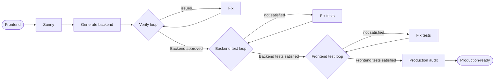

# Sunny — Multi-Agent Backend Engineering System

A collection of **Cursor AI agents** that turn a frontend application into a complete, enterprise-grade **JHipster microservices** backend — fully generated, verified, tested to 95%+ coverage, and audited for production readiness.

At the center is **Sunny**, an orchestrator that coordinates specialized agents through continuous verify → fix and test → verify loops until every quality gate passes. A standalone **documentation** agent (Swagger + Postman + Javadoc) is also included.

---

## What this repo is

This repository contains **agent definitions and orchestration rules** for Cursor — not application code. Point the agents at a frontend project and they produce and validate the backend.

```
.cursor/
├── rules/
│   └── sunny-orchestrator.mdc      # Executable playbook the orchestrator follows
└── agents/
    ├── README.md                          # Deep dive on how the Sunny system works
    ├── ARCHITECTURE.md                    # All architecture + workflow diagrams
    ├── sunny.md                           # Orchestrator persona
    ├── context-agent.md                   # Shared memory (.sunny/context/ store)
    ├── jhipster-backend-agent.md          # Generates the microservices backend
    ├── jhipster-verify-agent.md           # Audits the backend (readonly)
    ├── issue-resolution-agent.md          # Fixes issues found by the verifier
    ├── backend-unit-test-agent.md         # Backend unit tests
    ├── backend-integration-test-agent.md  # Backend integration tests (Testcontainers)
    ├── backend-functional-test-agent.md   # Backend functional/API tests
    ├── backend-test-verify-agent.md       # Verifies backend tests (readonly)
    ├── backend-test-fix-agent.md          # Closes backend test gaps
    ├── frontend-unit-test-agent.md        # Frontend unit tests
    ├── frontend-integration-test-agent.md # Frontend component tests (MSW)
    ├── frontend-functional-test-agent.md  # Frontend E2E tests (Playwright)
    ├── frontend-test-verify-agent.md      # Verifies frontend tests (readonly)
    ├── frontend-test-fix-agent.md         # Closes frontend test gaps
    ├── production-standards-agent.md      # Final production audit (readonly)
    └── documentation.md                   # Standalone: Swagger + Postman + Javadoc
```

At runtime, the Context Agent creates a `.sunny/context/` store that acts as shared memory across agent runs.

---

## The agents

### Sunny orchestration system

| Agent | Role | Readonly |
|-------|------|----------|
| **Sunny** | Orchestrates all agents, runs loops, enforces quality gates | No |
| **Context Agent** | Shared memory; persists structured summaries between runs | No |
| **JHipster Backend Agent** | Generates JHipster microservices (gateway + services + registry) | No |
| **JHipster Verify Agent** | Audits API, security, architecture, database | Yes |
| **Issue Resolution Agent** | Fixes every issue the verifier reports | No |
| **Backend Unit Test Agent** | Isolated unit tests (services, mappers, validators) | No |
| **Backend Integration Test Agent** | Repository/DB tests on Testcontainers PostgreSQL | No |
| **Backend Functional Test Agent** | REST/API + gateway HTTP contract tests | No |
| **Backend Test Verify Agent** | Verifies backend tests, edge cases, 95%+ coverage | Yes |
| **Backend Test Fix Agent** | Closes backend test gaps | No |
| **Frontend Unit Test Agent** | Isolated unit tests (utils, hooks, stores) | No |
| **Frontend Integration Test Agent** | Component/page tests with MSW, routing, state | No |
| **Frontend Functional Test Agent** | E2E user journeys (Playwright) | No |
| **Frontend Test Verify Agent** | Verifies frontend tests, edge cases, 95%+ coverage | Yes |
| **Frontend Test Fix Agent** | Closes frontend test gaps | No |
| **Production Standards Agent** | Final security / readiness / performance audit | Yes |

### Standalone (not orchestrated by Sunny)

| Agent | Role |
|-------|------|
| **Documentation Agent** | Complete Swagger/OpenAPI docs, Postman collections + Newman CI, and Javadoc — leaving nothing undocumented |

---

## Workflow at a glance



Backend tests use separate unit, integration, and functional agents; frontend tests likewise. Each loop breaks only on an **exact verdict phrase**, and caps at **5 iterations** before escalating to the user:

| Loop | Exit phrase |
|------|-------------|
| Backend verification | `No issues found. Backend approved.` |
| Backend testing | `Backend testing requirements satisfied.` |
| Frontend testing | `Frontend testing requirements satisfied.` |
| Production | `Final approval granted. System is production-ready.` |

> Full diagrams (component architecture, sequence, loops, data flow, state machine) are in [`.cursor/agents/ARCHITECTURE.md`](.cursor/agents/ARCHITECTURE.md).

---

## Non-negotiable standards

Enforced by every relevant agent:

- **JHipster microservices** architecture — never monolithic.
- **PostgreSQL** for all persistent data.
- **No mock data**, no fake CSV files, no dummy records — real persistence only.
- **>= 95%** line and branch coverage (backend and frontend), with build-failing gates.
- Enterprise APIs: REST, versioning, OpenAPI, RFC 7807 errors, JWT/OAuth2, RBAC.
- Production readiness: Docker, logging, monitoring, externalized config.

---

## How to use

These agents run inside **Cursor**. The `.cursor/agents/*.md` files are picked up automatically as custom agents, and `.cursor/rules/sunny-orchestrator.mdc` provides the orchestration playbook.

### Run the full pipeline

In a Cursor chat, invoke Sunny and point it at your frontend:

> Sunny, build the JHipster microservices backend for the frontend in `./frontend`.

Sunny will analyze the frontend, generate the backend, run the verification and testing loops, and finish with a production audit — announcing each phase and iteration as it goes. Progress and intermediate summaries are written to `.sunny/context/`.

### Run the documentation agent (standalone)

> Use the documentation agent to fully document this backend — Swagger, Postman, and Javadoc.

---

## Learn more

- [`.cursor/agents/README.md`](.cursor/agents/README.md) — how the Sunny system works, phase by phase.
- [`.cursor/agents/ARCHITECTURE.md`](.cursor/agents/ARCHITECTURE.md) — architecture and workflow diagrams.
- [`.cursor/rules/sunny-orchestrator.mdc`](.cursor/rules/sunny-orchestrator.mdc) — the orchestration playbook.
- Individual agent definitions under [`.cursor/agents/`](.cursor/agents/).
