# Sunny — Multi-Agent Backend Engineering System

A collection of **Cursor AI agents** that turn a frontend application into a complete, enterprise-grade **JHipster microservices** backend — fully generated, verified, tested to 95%+ coverage, and audited for production readiness.

At the center is **Sunny**, an orchestrator that coordinates specialized agents through continuous verify → fix and test → verify loops until every quality gate passes. Agents use **Graphify** (`graphify update`) for token-efficient codebase context. A standalone **documentation** agent (Swagger + Postman + Javadoc) is also included.

---

## What this repo is

This repository contains **agent definitions and orchestration rules** for Cursor — not application code. Point the agents at a frontend project and they produce and validate the backend.

```
.cursor/
├── rules/
│   ├── sunny-orchestrator.mdc      # Executable playbook the orchestrator follows
│   └── graphify.mdc                # Query-first context via graphify-out/ (token savings)
├── dashboard/                      # Live progress dashboard bundle (copied to .sunny/web/ at intake)
│   ├── agentprogress.html
│   ├── progress.json
│   ├── docker-compose.yml
│   └── nginx-progress.conf
├── central/                        # Fleet (global) dashboard — deploy on a central domain
│   ├── collector.py                # Dependency-free push collector (token-auth)
│   ├── global.html                 # One board for all independent VPS runs
│   ├── Dockerfile
│   ├── docker-compose.yml          # Collector + Nginx/TLS
│   ├── nginx-central.conf
│   └── README.md
└── agents/
    ├── README.md                          # Deep dive on how the Sunny system works
    ├── ARCHITECTURE.md                    # All architecture + workflow diagrams
    ├── sunny.md                           # Orchestrator persona
    ├── context-agent.md                   # Shared memory (.sunny/context/ store)
    ├── architecture-agent.md              # Designs architecture blueprint + boilerplate
    ├── architecture-verify-agent.md       # Reviews the architecture (readonly)
    ├── architecture-fix-agent.md          # Fixes architecture review findings
    ├── jhipster-backend-agent.md          # Generates the microservices backend
    ├── jhipster-verify-agent.md           # Audits the backend (readonly)
    ├── issue-resolution-agent.md          # Fixes issues found by the verifier
    ├── database-agent.md                  # Hardens DB connections, schema, migrations
    ├── database-verify-agent.md           # Audits the database layer (readonly)
    ├── database-fix-agent.md              # Fixes database review findings
    ├── nginx-agent.md                     # Nginx reverse proxy + domain + Certbot SSL
    ├── nginx-verify-agent.md              # Audits edge proxy & TLS (readonly)
    ├── nginx-fix-agent.md                 # Fixes nginx/SSL findings
    ├── backend-unit-test-agent.md                  # Backend unit tests
    ├── backend-unit-test-verify-agent.md           # Verifies backend unit tests (readonly)
    ├── backend-unit-test-fix-agent.md              # Closes backend unit-layer gaps
    ├── backend-integration-test-agent.md           # Backend integration tests (Testcontainers)
    ├── backend-integration-test-verify-agent.md    # Verifies backend integration tests (readonly)
    ├── backend-integration-test-fix-agent.md       # Closes backend integration-layer gaps
    ├── backend-functional-test-agent.md            # Backend functional/API tests
    ├── backend-functional-test-verify-agent.md     # Verifies backend functional tests (readonly)
    ├── backend-functional-test-fix-agent.md        # Closes backend functional-layer gaps
    ├── frontend-unit-test-agent.md                 # Frontend unit tests
    ├── frontend-unit-test-verify-agent.md          # Verifies frontend unit tests (readonly)
    ├── frontend-unit-test-fix-agent.md             # Closes frontend unit-layer gaps
    ├── frontend-integration-test-agent.md          # Frontend component tests (MSW)
    ├── frontend-integration-test-verify-agent.md   # Verifies frontend component tests (readonly)
    ├── frontend-integration-test-fix-agent.md      # Closes frontend component-layer gaps
    ├── frontend-functional-test-agent.md           # Frontend E2E tests (Playwright)
    ├── frontend-functional-test-verify-agent.md    # Verifies frontend E2E tests (readonly)
    ├── frontend-functional-test-fix-agent.md       # Closes frontend E2E-layer gaps
    ├── system-integration-test-agent.md            # Collective full-stack tests (frontend + backend + PostgreSQL)
    ├── system-integration-test-verify-agent.md     # Verifies cross-tier journeys on the real stack (readonly)
    ├── system-integration-test-fix-agent.md        # Closes collective full-stack testing gaps
    ├── swagger-agent.md / -verify-agent.md / -fix-agent.md          # Swagger/OpenAPI docs (gen/verify/fix)
    ├── javadoc-agent.md / -verify-agent.md / -fix-agent.md          # Javadoc (gen/verify/fix)
    ├── api-collection-agent.md / -verify-agent.md / -fix-agent.md   # Postman collection (gen/verify/fix)
    ├── api-test-agent.md / -verify-agent.md / -fix-agent.md         # API status tests (gen/verify/fix)
    ├── api-performance-test-agent.md / -verify-agent.md / -fix-agent.md  # API load tests 1/10/20/30 (gen/verify/fix)
    ├── production-standards-agent.md      # Final audit of ALL prior outputs + comprehensive report (readonly)
    ├── production-fix-agent.md            # Remediates production audit findings
    └── documentation.md                   # Standalone: Swagger + Postman + Javadoc

INSTALL.md                            # Prerequisites, VPS setup, Git workflow, edge cases
.gitignore                            # Never commit secrets, .sunny/, builds, certs
.gitattributes                        # LF line endings for Linux VPS after Windows dev
.env.example                          # Environment template (copy to .env on VPS)
```

At runtime, the Context Agent creates a `.sunny/context/` store that acts as shared memory across agent runs.

---

## The agents

### Sunny orchestration system

| Agent | Role | Readonly |
|-------|------|----------|
| **Sunny** | Orchestrates all agents, runs loops, enforces quality gates | No |
| **Context Agent** | Shared memory; persists structured summaries between runs | No |
| **Architecture Agent** | Designs architecture blueprint + boilerplate from the frontend | No |
| **Architecture Verify Agent** | Reviews decomposition, API coverage, JDL, auth design | Yes |
| **Architecture Fix Agent** | Fixes architecture review findings | No |
| **JHipster Backend Agent** | Generates JHipster microservices (gateway + services + registry) | No |
| **JHipster Verify Agent** | Audits API, security, architecture, database | Yes |
| **Issue Resolution Agent** | Fixes every issue the verifier reports | No |
| **Database Agent** | Hardens DB connections, schema, migrations, standards | No |
| **Database Verify Agent** | Audits DB layer (schema, migrations, no mock data) | Yes |
| **Database Fix Agent** | Fixes database review findings | No |
| **Nginx & SSL Edge Agent** | Reverse proxy: connects frontend + gateway to domain; Certbot/Let's Encrypt | No |
| **Nginx Verify Agent** | Audits Nginx routing, HTTPS, certificate renewal | Yes |
| **Nginx Fix Agent** | Fixes nginx/SSL findings | No |
| **Backend Unit Test Agent** | Isolated unit tests (services, mappers, validators) | No |
| **Backend Unit Test Verify Agent** | Verifies backend unit-layer coverage/quality | Yes |
| **Backend Unit Test Fix Agent** | Closes backend unit-layer gaps | No |
| **Backend Integration Test Agent** | Repository/DB tests on Testcontainers PostgreSQL | No |
| **Backend Integration Test Verify Agent** | Verifies backend integration-layer coverage/quality | Yes |
| **Backend Integration Test Fix Agent** | Closes backend integration-layer gaps | No |
| **Backend Functional Test Agent** | REST/API + gateway HTTP contract tests | No |
| **Backend Functional Test Verify Agent** | Verifies backend functional-layer coverage/quality | Yes |
| **Backend Functional Test Fix Agent** | Closes backend functional-layer gaps | No |
| **Frontend Unit Test Agent** | Isolated unit tests (utils, hooks, stores) | No |
| **Frontend Unit Test Verify Agent** | Verifies frontend unit-layer coverage/quality | Yes |
| **Frontend Unit Test Fix Agent** | Closes frontend unit-layer gaps | No |
| **Frontend Integration Test Agent** | Component/page tests with MSW, routing, state | No |
| **Frontend Integration Test Verify Agent** | Verifies frontend component-layer coverage/quality | Yes |
| **Frontend Integration Test Fix Agent** | Closes frontend component-layer gaps | No |
| **Frontend Functional Test Agent** | E2E user journeys (Playwright) | No |
| **Frontend Functional Test Verify Agent** | Verifies frontend E2E journey coverage | Yes |
| **Frontend Functional Test Fix Agent** | Closes frontend E2E gaps | No |
| **System Integration Test Agent** | Collective full-stack tests (frontend + backend + PostgreSQL together) | No |
| **System Integration Test Verify Agent** | Verifies cross-tier journey coverage on the real running stack | Yes |
| **System Integration Test Fix Agent** | Closes collective full-stack testing gaps | No |
| **Swagger Agent / Verify / Fix** | OpenAPI/Swagger docs for every endpoint; verify spec; close gaps | No / Yes / No |
| **Javadoc Agent / Verify / Fix** | Javadoc for every public Java API (failOnWarnings); verify; close gaps | No / Yes / No |
| **API Collection Agent / Verify / Fix** | Postman collection + Newman CI; verify coverage; close gaps | No / Yes / No |
| **API Test Agent / Verify / Fix** | Assert every endpoint returns correct/appropriate status; verify; fix | No / Yes / No |
| **API Performance Test Agent / Verify / Fix** | Load test at 1/10/20/30 concurrency; verify thresholds; remediate | No / Yes / No |
| **Production Standards Agent** | Audits ALL prior outputs (do's/don'ts) + final security/readiness audit + comprehensive report | Yes |
| **Production Fix Agent** | Remediates production audit findings | No |

### Standalone (not orchestrated by Sunny)

| Agent | Role |
|-------|------|
| **Documentation Agent** | Complete Swagger/OpenAPI docs, Postman collections + Newman CI, and Javadoc — leaving nothing undocumented |
| **Fleet Host Agent (Hari)** | Run-once: deploys the global/fleet dashboard (central collector + TLS) on the fleet domain so all VPS runs show on one board |

---

## Agent codenames

Every agent has a human codename. A family shares a base name; its verify/fix variants add `Verify`/`Fix` — e.g. **Vikram** (`jhipster-backend-agent`), **Vikram Verify** (`jhipster-verify-agent`), **Vikram Fix** (`issue-resolution-agent`).

| Family | Generate | Verify (readonly) | Fix |
|--------|----------|-------------------|-----|
| Arjun (architecture) | Arjun | Arjun Verify | Arjun Fix |
| Vikram (backend build) | Vikram | Vikram Verify | Vikram Fix |
| Dhruv (database) | Dhruv | Dhruv Verify | Dhruv Fix |
| Naveen (nginx & SSL) | Naveen | Naveen Verify | Naveen Fix |
| Rohan (backend unit tests) | Rohan | Rohan Verify | Rohan Fix |
| Karan (backend integration tests) | Karan | Karan Verify | Karan Fix |
| Aditya (backend functional tests) | Aditya | Aditya Verify | Aditya Fix |
| Priya (frontend unit tests) | Priya | Priya Verify | Priya Fix |
| Neha (frontend integration tests) | Neha | Neha Verify | Neha Fix |
| Anika (frontend functional tests) | Anika | Anika Verify | Anika Fix |
| Sanjay (system integration tests) | Sanjay | Sanjay Verify | Sanjay Fix |
| Surya (Swagger) | Surya | Surya Verify | Surya Fix |
| Jaya (Javadoc) | Jaya | Jaya Verify | Jaya Fix |
| Chetan (API collection) | Chetan | Chetan Verify | Chetan Fix |
| Tara (API tests) | Tara | Tara Verify | Tara Fix |
| Pawan (API performance) | Pawan | Pawan Verify | Pawan Fix |
| Prakash (production) | — | Prakash | Prakash Fix |

**Singletons:** Sunny (orchestrator) · Maya (shared memory / context) · Deepa (standalone documentation) · Hari (standalone fleet-host — deploys the global dashboard). The full codename → slug mapping is in [`.cursor/agents/README.md`](.cursor/agents/README.md#agent-codenames).

## Workflow at a glance

```mermaid
flowchart LR
    FE([Frontend]) --> S[Sunny]
    S --> AL{Architecture loop}
    AL -->|issues| AFIX[Fix] --> AL
    AL -->|"Architecture approved"| GEN[Generate backend]
    GEN --> VL{Verify loop}
    VL -->|issues| FIX[Fix] --> VL
    VL -->|"Backend approved"| DL{Database loop}
    DL -->|issues| DFIX[Fix] --> DL
    DL -->|"Database approved"| NL{Nginx & SSL loop}
    NL -->|issues| NFIX[Fix] --> NL
    NL -->|"Nginx and SSL approved"| BTL{"Backend test loops<br/>unit -> integration -> functional"}
    BTL -->|"layer not satisfied"| BFIX[Fix that layer] --> BTL
    BTL -->|"all 3 backend layers satisfied"| FTL{"Frontend test loops<br/>unit -> integration -> functional"}
    FTL -->|"layer not satisfied"| FFIX[Fix that layer] --> FTL
    FTL -->|"all 3 frontend layers satisfied"| SIL{"System integration loop<br/>frontend + backend + PostgreSQL"}
    SIL -->|"gaps"| SIFIX[Fix] --> SIL
    SIL -->|"System integration testing satisfied"| DAL{"Doc & API loops<br/>Swagger -> Javadoc -> API collection -> API tests -> API performance"}
    DAL -->|"stage gaps"| DAFIX[Fix that stage] --> DAL
    DAL -->|"all 5 doc/API stages satisfied"| PL{"Production loop<br/>audits ALL prior outputs + final report"}
    PL -->|"findings"| PFIX[Fix production] --> PL
    PL -->|"Final approval granted"| DONE([Production-ready])
```



The pipeline runs **architecture → backend (JHipster) → database → nginx & SSL (domain + Certbot) → backend tests → frontend tests → system integration tests → Swagger → Javadoc → API collection → API tests → API performance → production**. Backend and frontend tests each split into **three layers — unit, integration, functional — and each layer has its own generation, verify, and fix agent**; the system integration stage then exercises the **whole stack together** (real frontend + gateway + microservices + PostgreSQL); then five documentation/API stages run in order (Swagger first, since its spec feeds the API collection and API tests); finally the production agent audits every prior stage and produces a comprehensive report. Every phase runs a verify -> fix -> re-verify loop that breaks only on an **exact verdict phrase**, and caps at **5 iterations** per loop before escalating to the user:

| Loop | Exit phrase |
|------|-------------|
| Architecture | `Architecture approved.` |
| Backend verification | `No issues found. Backend approved.` |
| Database | `Database approved.` |
| Nginx & SSL | `Nginx and SSL approved.` |
| Backend unit testing | `Backend unit testing requirements satisfied.` |
| Backend integration testing | `Backend integration testing requirements satisfied.` |
| Backend functional testing | `Backend functional testing requirements satisfied.` |
| Frontend unit testing | `Frontend unit testing requirements satisfied.` |
| Frontend integration testing | `Frontend integration testing requirements satisfied.` |
| Frontend functional testing | `Frontend functional testing requirements satisfied.` |
| System integration testing | `System integration testing requirements satisfied.` |
| Swagger / OpenAPI | `Swagger documentation requirements satisfied.` |
| Javadoc | `Javadoc documentation requirements satisfied.` |
| API collection | `API collection requirements satisfied.` |
| API tests | `API testing requirements satisfied.` |
| API performance | `API performance testing requirements satisfied.` |
| Production | `Final approval granted. System is production-ready.` |

> Full diagrams (component architecture, sequence, loops, data flow, state machine) are in [`.cursor/agents/ARCHITECTURE.md`](.cursor/agents/ARCHITECTURE.md).

---

## Graphify (token-efficient context)

Operators pre-install Graphify before running Sunny:

```bash
uv tool install graphifyy
graphify install
```

Agents **query** `graphify-out/` first (`graphify query`, `path`, `explain`) instead of reading entire trees. After code changes they run **`graphify update <project-root>`** so the next agent gets a current graph. See [`.cursor/rules/graphify.mdc`](.cursor/rules/graphify.mdc).

## Non-negotiable standards

Enforced by every relevant agent:

- **JHipster microservices** architecture — never monolithic.
- **PostgreSQL** for all persistent data.
- **No mock data**, no fake CSV files, no dummy records — real persistence only.
- **>= 95%** line and branch coverage (backend and frontend), with build-failing gates.
- Enterprise APIs: REST, versioning, OpenAPI, RFC 7807 errors, JWT/OAuth2, RBAC.
- Production readiness: Docker, logging, monitoring, externalized config.

---

## How to use

These agents run inside **Cursor**. The `.cursor/agents/*.md` files are picked up automatically as custom agents, and `.cursor/rules/sunny-orchestrator.mdc` provides the orchestration playbook.

**Before the first run:** install prerequisites on your machine or VPS and set up Git — see **[INSTALL.md](INSTALL.md)** (Java, Node, Docker, Graphify, firewall, `.env`, clone/push workflow, edge cases). Use the root **[`.gitignore`](.gitignore)** so secrets, `.sunny/`, builds, and certs are never pushed to GitHub.

### Run the full pipeline

In a Cursor chat, invoke Sunny and point it at your frontend:

> Sunny, build the JHipster microservices backend for the frontend in `./frontend`. Project domain: `mememates.org`. Fleet domain: `fleet.example.com`.

Provide **only** the **project domain** and **fleet domain** at kickoff — agents generate `.env` secrets, fetch the fleet push token, configure dashboards, and wire Nginx/Certbot. Optional: add a Certbot email; otherwise agents use `admin@<project-domain>`. Sunny will analyze the frontend, design the architecture, generate the backend, harden the database, configure Nginx + SSL on the domain (Certbot), run the backend and frontend testing loops, run collective system integration tests across the whole stack, produce and verify the documentation & API stages (Swagger, Javadoc, Postman collection, API status tests, and API performance at 1/10/20/30 concurrency), and finish with a production audit that reviews every prior stage and emits a comprehensive final report — announcing each phase and iteration as it goes. Progress and intermediate summaries are written to `.sunny/context/`.

### Watch live progress

From the **first** agent, Sunny serves a live dashboard showing completed/pending stages, the current phase, time consumed, estimated total, and time remaining (auto-refreshing every 5 minutes):

- **Early (intake → before Nginx):** a tiny static publisher → `http://<server-ip>:8787/agentprogress.html`.
- **From the Nginx stage onward:** the same page on your domain over HTTPS → `https://<domain>/agentprogress.html` (the early publisher is retired).

The dashboard is a read-only artifact under `.sunny/web/` — it never touches the generated backend. Maya (the Context Agent) rewrites `.sunny/web/progress.json` after every agent handoff. When a run needs something only you can provide (e.g. an external provider API key), it shows up as an **"Action required"** card — the run keeps going; you add the value to `.env` and that stage picks it up.

### Fleet view across many VPSs (optional)

> **Step-by-step runbook:** [`FLEET-QUICKSTART.md`](FLEET-QUICKSTART.md) — exactly what to type on your **first VPS** (fleet host + build) vs. **later VPSs** (build only).

Run Sunny on as many VPSs as you like — each is fully independent with its own local dashboard. **Deploy the global dashboard with an agent:** on the host that owns your **fleet domain**, invoke the **Fleet Host Agent (Hari)** once — *"Sunny, set up the fleet dashboard host. Fleet domain: `fleet.example.com` (admin@…)."* Hari brings up the central collector (`.cursor/central/`) with TLS and validates it. Then on each worker, give Sunny **project domain + fleet domain** — Maya fetches the push token and pushes after every handoff. `https://<fleet-domain>/` shows one card per run. (You still set the fleet domain's DNS A record + open 80/443; Hari checks and reports these. Manual steps remain in [`.cursor/central/README.md`](.cursor/central/README.md).) The fleet host is **visibility only, not HA** — if it goes down, workers keep building. For a public fleet domain, enable Basic-Auth on the dashboard per the central README **"Exposure model"**.

### Nothing silently stalls (non-blocking)

Every verify/fix loop keeps its hard iteration cap, but the pipeline **notifies instead of halting**: when a loop gives up or an external value is missing, the item becomes a `needs-attention`/`action-required` notification on the local + fleet dashboards and Sunny continues to the next stage wherever technically possible. Only a hard technical dependency (e.g. the backend won't build) causes a real stop. Outstanding items are collected in the final production report.

### Resumes from where it stopped (crash / reboot / closed session safe)

The run never loses its place. All state lives on disk — `.sunny/context/state.json` (phase, iteration counters, per-stage status, verdicts), the context summaries, `.env`, and the generated code — and Maya checkpoints it **atomically after every agent handoff**. If the VPS reboots, the Cursor session closes, or an agent crashes, just re-invoke **"Sunny, resume"** (or the original prompt) in the project: Sunny runs a resume check first, skips every completed stage, re-enters the interrupted one, and continues with iteration counters and pending "action required" items intact. Every agent is **idempotent** (it patches/continues instead of duplicating), so re-running a stage is always safe. Docker services restart themselves (`restart: unless-stopped`).

### Restarts (so changes take effect)

The whole system runs as a Docker Compose stack (PostgreSQL + registry + gateway + microservices + frontend + Nginx). Code/config changes only apply once the affected services are rebuilt and restarted, so:

- Backend/database changes → rebuild + restart the affected services (`docker compose up -d --build <service>`) and re-apply migrations.
- The **frontend** is rebuilt + restarted when its API base URL moves to the domain (`/api`) at the Nginx stage.
- **Nginx** uses a **graceful reload** (`nginx -t && nginx -s reload`) — zero downtime.
- The system-integration, API-test, and API-performance stages run against a **freshly (re)started, healthy** stack.
- The **dashboard keeps running through every restart** — the early publisher is a separate container, Nginx reloads gracefully, and `.sunny/web` is a static mount, so you never lose progress visibility.

### Run the documentation agent (standalone)

> Use the documentation agent to fully document this backend — Swagger, Postman, and Javadoc.

---

## Learn more

- **[INSTALL.md](INSTALL.md)** — what to install (React, Java/JHipster, Docker, Graphify, …), VPS setup, `.gitignore`, GitHub clone/push workflow, edge cases.
- [`.gitignore`](.gitignore) — never commit `.env`, `.sunny/`, `node_modules/`, `target/`, certs, `graphify-out/`.
- [`.env.example`](.env.example) — reference template; the real `.env` is auto-generated with secrets by Maya at intake (copy only to override).
- [`.cursor/agents/AGENT-GUIDE.md`](.cursor/agents/AGENT-GUIDE.md) — what every single agent does, clearly explained.
- [`.cursor/agents/README.md`](.cursor/agents/README.md) — how the Sunny system works, phase by phase.
- [`.cursor/agents/ARCHITECTURE.md`](.cursor/agents/ARCHITECTURE.md) — architecture and workflow diagrams.
- [`.cursor/rules/sunny-orchestrator.mdc`](.cursor/rules/sunny-orchestrator.mdc) — the orchestration playbook.
- [`.cursor/rules/graphify.mdc`](.cursor/rules/graphify.mdc) — Graphify query-first context (token savings).
- Individual agent definitions under [`.cursor/agents/`](.cursor/agents/).
